!!! info "Understanding OS filesystem architecture"

    This section documents how filesystem APIs are structured on each platform.
    
    Understanding these architectures is essential for implementing the VFS; as it allows
    you to identify the correct interception points for file operations.

!!! note "TODO: Add `IoRing`/`io_uring` APIs"

    I haven't added the new Win11 APIs yet to this page.

    For information about `IoRing`/`io_uring`, used in DirectStorage and the like, see [DirectStorage & IoRing](Technology-Integrations/DirectStorage.md#ioring---linux---windows).

## Windows

!!! tip "All user-mode file I/O APIs funnel through `ntdll.dll`"

    `ntdll.dll` is the lowest-level user-mode library on Windows. It is a wrapper around kernel system calls to `ntoskrnl.exe`.
    
    All higher-level file I/O APIs eventually call `ntdll.dll` functions:
    
    - Win32 APIs (`CreateFileW`, `ReadFile`) → `kernel32.dll` → `ntdll.dll` → `ntoskrnl.exe` (via unstable syscalls)
    - C Runtime (`fopen`, `fread`) → `ucrtbase.dll` → `kernel32.dll` → `ntdll.dll` → `ntoskrnl.exe` (via unstable syscalls)
    - C++ STL (`std::ifstream`) → CRT → `kernel32.dll` → `ntdll.dll` → `ntoskrnl.exe` (via unstable syscalls)
    
    This makes `ntdll.dll` the single interception point for all file operations on Windows.
    
    **Critical:** Unlike Linux, Windows syscall numbers are **not stable** between versions. This is why `ntdll.dll` exists as a stable abstraction layer- all normal user-mode software goes through it.

!!! note "These graphs were last updated in 6th-9th December 2025."

    Using Windows 11 25H2 as reference.
    
    Irrelevant APIs (e.g. Path Conversion `RtlDosPathNameToRelativeNtPathName`) are omitted for clarity; these converted paths will be passed to our hooks, e.g. `NtCreateFile_Hook`, in which case we do not need to concern ourselves with them.

    This graph focuses on the ***entry points*** into `ntdll.dll` (and thus, the VFS). Redundant calls are omitted for clarity. For example, when a function calls `NtCreateFile` and then `NtClose` to clean up the file handle, only the `NtCreateFile` call is shown in the graph.

!!! tip "Chart Organization"

    The API flow charts are split into logical groups based on functionality and dependencies. Each chart shows how Win32 APIs funnel down to NT API entry points.

The graphs below were painstakingly constructed by disassembling `kernel32.dll`, `KERNELBASE.dll`, `ntdll.dll`, and the misc `msvcrt` DLLs for an entire 3 day weekend.

#### Directory Enumeration

All `FindFirst*` and `FindNext*` APIs converge through internal functions to `NtQueryDirectoryFileEx` for directory listing operations.

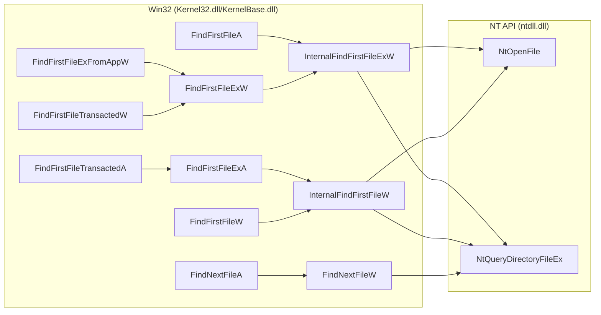

### File & Directory Creation

All `CreateFile*` and `CreateDirectory*` APIs funnel through internal functions to `NtCreateFile`, along with optional metadata operations.

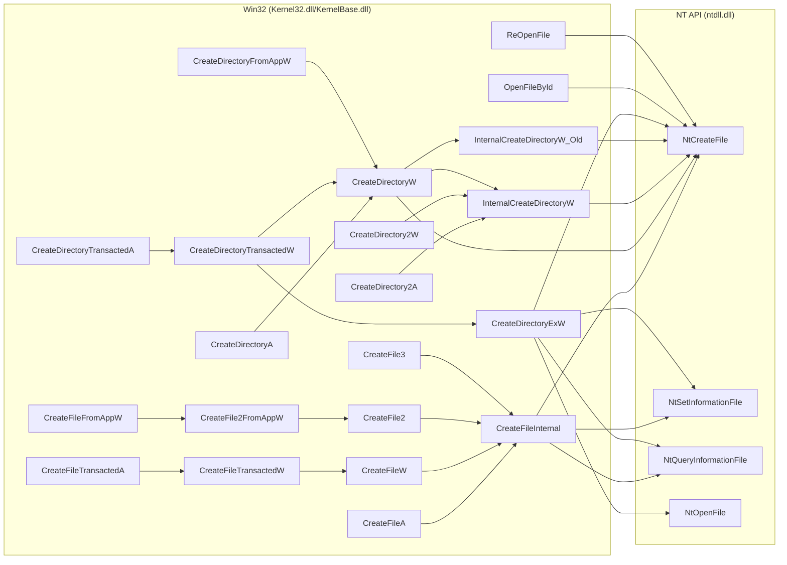

!!! info "ReOpenFile"

    Operates on existing handle (already redirected). No path redirection needed.

### File & Directory Deletion

All deletion APIs (`DeleteFile*` and `RemoveDirectory*`) converge through internal functions (`InternalDeleteFileW` and `InternalRemoveDirectoryW`) to NT-level operations.

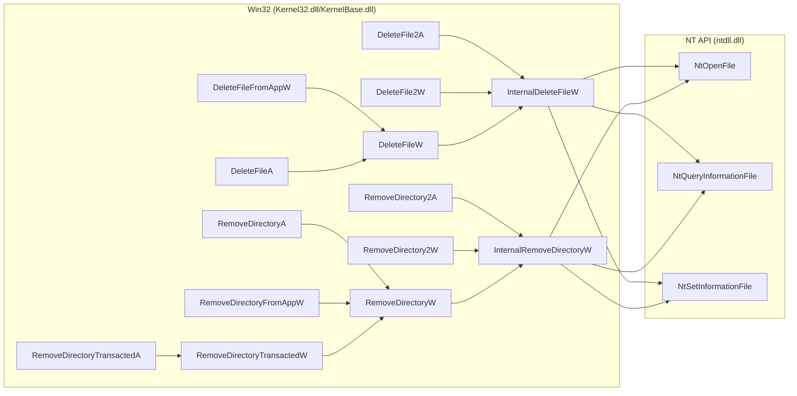

### Read/Write Operations

All file read and write operations, including file pointer positioning and file size modification, funnel through NT-level read/write APIs.

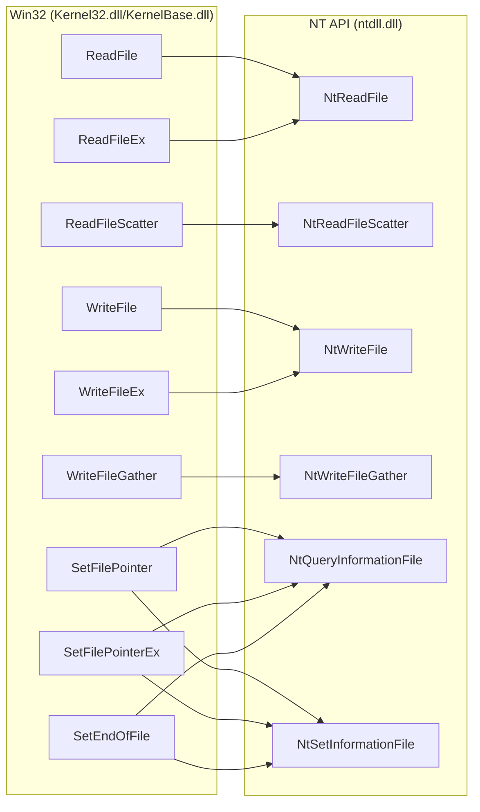

### File Attributes

Query and modification of file attributes. Path-based queries use `GetFileAttributes*` and `SetFileAttributes*` APIs, handle-based queries use `GetFileInformationByHandle*` APIs, and name-based queries use `GetFileInformationByName`.

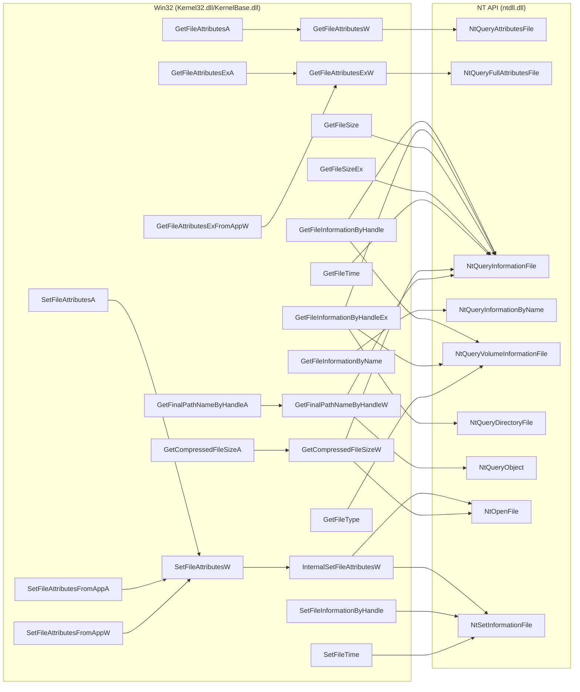

!!! info "NtQueryVolumeInformationFile does not need emulation"

    `NtQueryVolumeInformationFile` queries volume-level information (filesystem type, serial number, etc.) rather than individual file metadata. Since we're not virtualizing entire volumes, this API can pass through without interception.

!!! info "GetCompressedFileSize* APIs"

    `GetCompressedFileSizeA` and `GetCompressedFileSizeW` query the on-disk size of NTFS compressed files (which differs from logical file size for compressed files). For virtual files, return the regular file size. For redirected files, simply redirect the path and let the underlying file system report its compressed size.

!!! info "GetFileVersion* APIs"

    `GetFileVersionInfoA`, `GetFileVersionInfoW`, `GetFileVersionInfoExA`, `GetFileVersionInfoExW`, and related APIs extract embedded version resources from PE files. These are handled by the standard file read/open APIs (`NtCreateFile`, `NtReadFile`) and don't require separate hooking.

#### File Copy, Move & Replace Operations

All `CopyFile*` variants converge through `BasepCopyFileExW`. `MoveFile*` variants converge through `MoveFileWithProgressTransactedW` or `MoveFileWithProgressW`, with some move operations delegating to copy for cross-volume moves. `ReplaceFile*` variants converge through `ReplaceFileExInternal`.

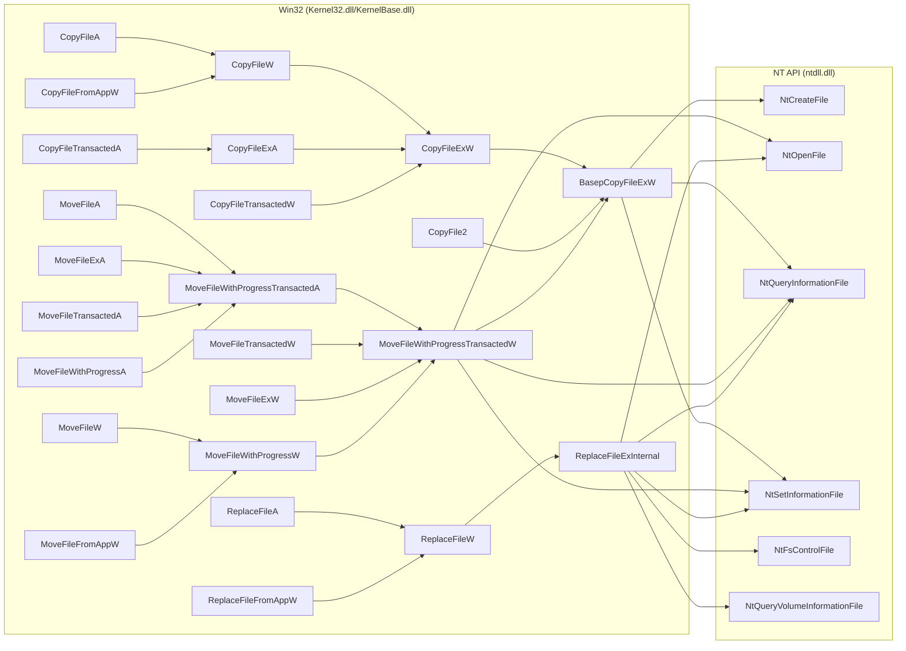

### Links & Symbolic Links

Creation and enumeration of hard links and symbolic links through dedicated APIs.

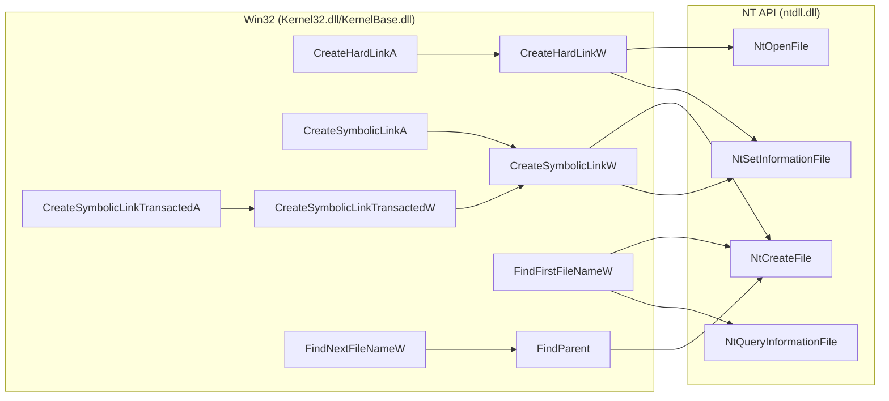

### Change Notifications

Directory change monitoring APIs for tracking file system modifications.

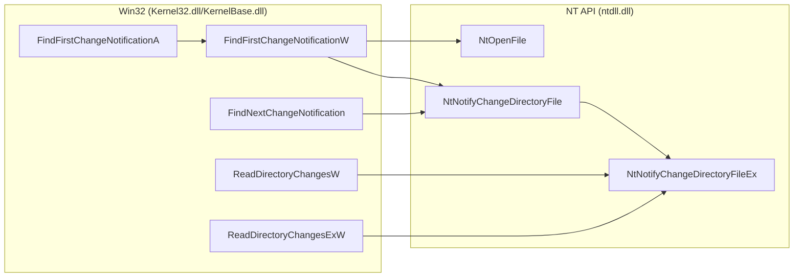

### Handle Lifetime Management

Handle cleanup operations that need hooking for internal state tracking.

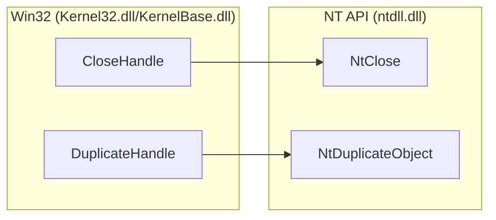

!!! info "Why hook NtClose?"

    We need to hook `NtClose` for lifetime management - tracking when file handles are closed to clean up internal VFS state.

!!! info "Why hook NtDuplicateObject?"

    We need to hook `NtDuplicateObject` to track handle duplication - when a handle is duplicated (explicitly via `DuplicateHandle` or through process inheritance), both handles refer to the same virtual file state. Layer 2 must track all handles to properly manage virtual file lifecycle.
    
    The use case is to reopen a handle with different permissions, but there's no reason for games to do this. Included for completeness - never observed in actual game usage.

### Memory Mapped Files

Memory-mapped file operations are split into three main categories: creating file mapping objects, mapping views into memory, and managing mapped views.

#### File Mapping Creation

All `CreateFileMapping*` APIs for memory-mapped file creation converge to NT section APIs.

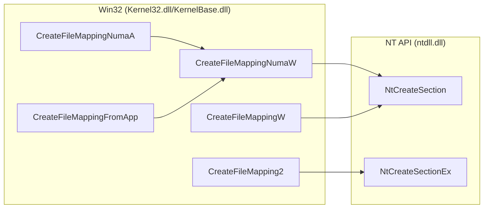

#### Mapping Views

All `MapViewOfFile*` APIs map sections into the process address space, and `UnmapViewOfFile*` APIs unmap them, converging to NT view mapping APIs.

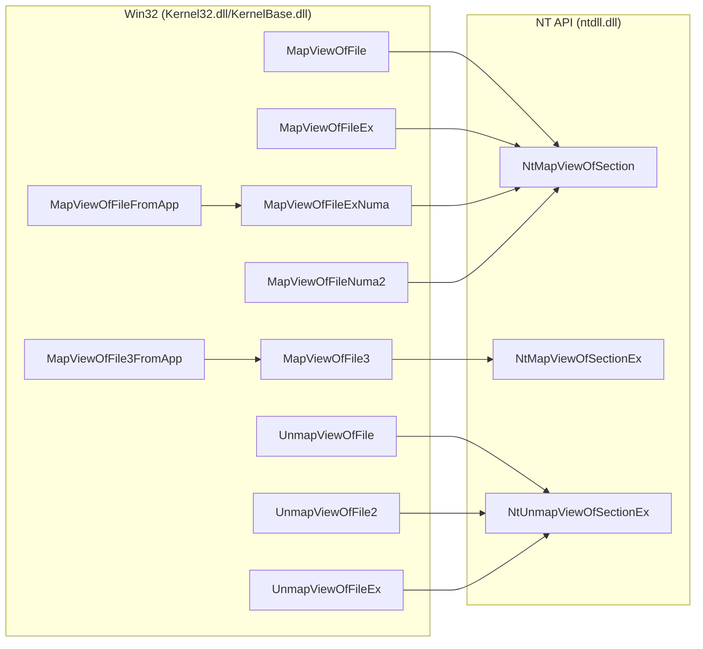

#### View Management

View flushing and write tracking operations for managing mapped memory regions.

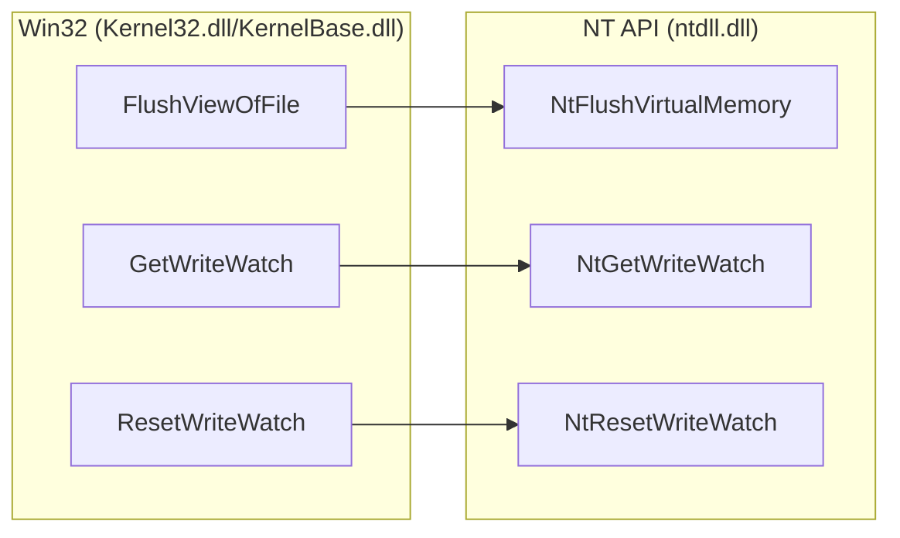

### Notable Functions (Not Relevant for Games)

!!! info "We don't care about these APIs"

    The following APIs are documented for completeness but are **not relevant** for game modding:
    
    - They have not been used in games
    - They have no reason to be used in games  
    - Game stores don't support these features

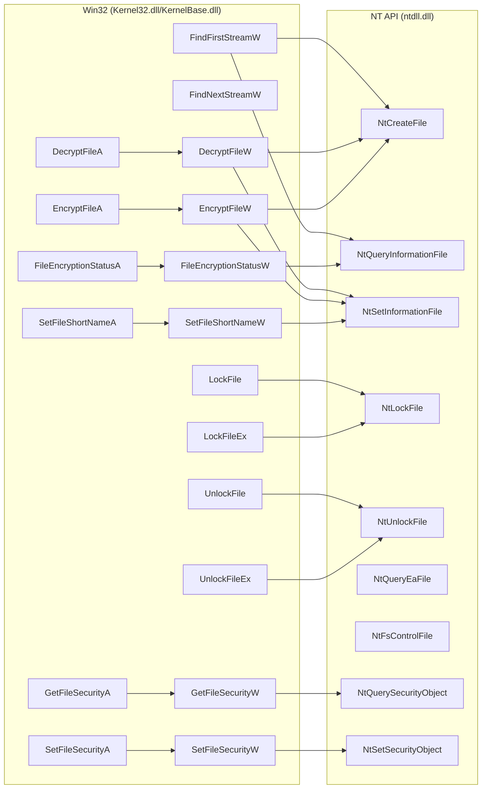

**What are these APIs:**

- **NTFS Alternate Data Streams** (`FindFirstStreamW`, `FindNextStreamW`) - Unsupported by game stores.
- **File Locking** (`LockFile`, `LockFileEx`, `UnlockFile`, `UnlockFileEx`) - Never seen a program that uses these APIs.
- **File Encryption** (`DecryptFile*`, `EncryptFile*`, `FileEncryptionStatus*`, `OpenEncryptedFileRaw*`) - Not supported with any game store, or even legacy games.
- **Security Descriptors** (`GetFileSecurity*`, `SetFileSecurity*`, `GetSecurityInfo`, `SetSecurityInfo`, `GetNamedSecurityInfo*`, `SetNamedSecurityInfo*`) - ACL management. Not supported with any game store, or even legacy games.
- **DOS Short Names** (`SetFileShortName*`) - Legacy DOS 8.3 filename support. Not needed for games.
- **LZ Expansion** ([lzexpand.h](https://learn.microsoft.com/en-us/windows/win32/api/lzexpand/)) - Ancient deprecated API (`LZOpenFileW` → `LZOpenFileA` → `OpenFile`, etc.). Would be redirected with existing hooks.
- **Extended Attributes** (`NtQueryEaFile`) - DOS attributes, NTFS security descriptors, etc. Games can't have these, Windows specific and stores don't support it.
- **File System Control** (`NtFsControlFile`) - Making sparse files, enabling NTFS compression, create junctions. This operates on file handles from `NtCreateFile`, so should still be redirected nonetheless.
- **Opening Existing Memory Maps** (`OpenFileMappingW`, `OpenFileMappingFromApp`) - These are used to open existing memory maps, i.e. those we're already handling elsewhere.

!!! note "Roots (as of Windows 11 25H2)"

    Look at [Fileapi.h](https://learn.microsoft.com/en-us/windows/win32/api/fileapi/nf-fileapi-createdirectory2a) and [Winbase.h](https://learn.microsoft.com/en-us/windows/win32/api/winbase/nf-winbase-createdirectorytransacteda). These are good resources that are fairly up to date for Win32.
    For UWP, see [Fileapifromapp.h](https://learn.microsoft.com/en-us/windows/win32/api/fileapifromapp/nf-fileapifromapp-createfilefromappw).

    The above graphs were made using those as the starting point; combines with own searching through exports.

!!! info "About Transactional NTFS (Deprecated)"

    This is a feature introduced in Windows Vista (2007), and deprecated in Windows 8 in 2012. It was deprecated due to lack of adoption and complexity. Documentation heavily discourages its use and notes it as 'slated for removal'.

    The code for this function wasn't even moved from `kernel32.dll` to `kernelbase.dll`. Likewise, I've never to date seen a program that uses this feature.

    Behind the scenes this uses the regular APIs, but wrapped around `RtlGetCurrentTransaction` and `RtlSetCurrentTransaction` calls. So whatever we write will nonetheless work out the box. Included in the graphs for completeness.

    - ✅ `CopyFileTransactedA`
    - ✅ `CopyFileTransactedW`
    - ✅ `CreateDirectoryTransactedA`
    - ✅ `CreateDirectoryTransactedW`
    - ✅ `CreateFileTransactedA`
    - ✅ `CreateFileTransactedW`
    - ✅ `CreateSymbolicLinkTransactedA`
    - ✅ `CreateSymbolicLinkTransactedW`
    - ✅ `FindFirstFileTransactedA`
    - ✅ `FindFirstFileTransactedW`

!!! info "About WinRT/UWP Brokered 'FromApp' Functions (Windows 10 1803+)"

    Brokered calls are API calls that go through `RuntimeBroker.exe`, which acts as a security intermediary between UWP apps running in an AppContainer sandbox and system resources they need to access.
    
    The broker enforces capability-based security and permission checks.

    There are 2 types of APIs supported for WinRT/UWP:

    1. APIs such as `CreateFile2`. These are heavily restricted to only support `ApplicationData.LocalFolder` or `Package.InstalledLocation` directories. 
    2. APIs such as `CreateFile2FromAppW` will first run e.g. `CreateFile2`, and if that fails, it will route through the 'broker', i.e. `BrokeredCreateFile2` in `ext-ms-win-winrt-storage-win32broker-;1-1-0.dll`.
        - This would require an extra hook on a separate process.

    I have not experimented, but based on code inspection, it'll redirect, then likely fail due to `ApplicationData.LocalFolder`/`Package.InstalledLocation` limitation, and then try routing through the broker (separate process).

    !!! warning "This is inconsequential for most games."

        ***This section concerns ONLY TRUE UWP APPS***

        Most (pretty much all) games on the Xbox Store are Win32 titles which run using 'Desktop Bridge' a.k.a. 'Project Centennial'.

        These Apps declare `<rescap:Capability Name="runFullTrust" />` in `AppXManifest.xml`, meaning they have full access to the filesystem like regular Win32 apps.

        In those (basically all) cases, the VFS will run just fine, as it has been for a good handful of games with existing Reloaded-II mods.

        It may be possible you can just add `runFullTrust` to any pure UWP app to have it work; that I'm not sure. Never ran into a real UWP game.
        
        Even if VFS hooks work for pure UWP apps, accessing the game folder would require dealing with the classic read/write restrictions of the `WindowsApps` folder for non-Win32 apps. Not fun.

!!! note "On Windows 10 1709+, `NtQueryDirectoryFileEx` API becomes available and `NtQueryDirectoryFile` acts as a wrapper around it."

    In the VFS we would hook both APIs, and detect if one recurses to the other using a semaphore. If we're recursing from `NtQueryDirectoryFile` to `NtQueryDirectoryFileEx`, we skip the hook code.
    
    **`NtNotifyChangeDirectoryFileEx`:** Conversely, `NtNotifyChangeDirectoryFile` wraps `NtNotifyChangeDirectoryFileEx` on modern Windows versions. I have not verified which version made this change.
    
    **Wine Compatibility:** These `Ex` variants are not implemented in Wine. The base APIs (`NtQueryDirectoryFile` and `NtNotifyChangeDirectoryFile`) work directly without wrapper behaviour.

### Linux

!!! info "Native Linux games, not Wine"

    This covers native Linux games only. Wine is covered by the Windows section above.

!!! tip "Linux has a stable syscall interface"

    Unlike Windows, Linux provides stable syscalls. This means programs can call into the kernel directly, though manually doing so is not advised.
    
    In practice, >99% of programs/games are built with `glibc`:
    
    program → `glibc` (`libc`) → kernel
    
    However, in some cases they may be built with `musl` (where the libc is statically linked with no exports), or using a language like Zig that syscalls directly by default.

!!! tip "Linux file I/O syscalls are simpler than Windows NT APIs"

    On Windows, you get a few very heavily overloaded functions with 10s of flags. On Linux you get a separate function for each operation, with few flags if any.
    
    Therefore it's easier to implement the VFS on Linux, as you don't have to work with every possible flag combination.

#### File I/O System Calls

!!! warning "This list needs review"

    I only had a quick glance and generated this list based on syscall list with LLM help, this needs an extra review.

The following syscalls handle file and directory operations on Linux (x86_64):

**File Opening & Creation:**

- `open` (2) - Open/create file
- `openat` (257) - Open/create file relative to directory fd
- `openat2` (437) - Extended open with more options
- `creat` (85) - Create or truncate file
- `close` (3) - Close file descriptor

**File Reading & Writing:**

- `read` (0) - Read from file
- `write` (1) - Write to file
- `pread64` (17) - Read from file at offset
- `pwrite64` (18) - Write to file at offset
- `readv` (19) - Read into multiple buffers
- `writev` (20) - Write from multiple buffers
- `preadv` (295) - Read into multiple buffers at offset
- `pwritev` (296) - Write from multiple buffers at offset
- `preadv2` (327) - Extended preadv with flags
- `pwritev2` (328) - Extended pwritev with flags

**File Position & Attributes:**

- `lseek` (8) - Reposition file offset
- `truncate` (76) - Truncate file to specified length
- `ftruncate` (77) - Truncate file using fd
- `fallocate` (285) - Preallocate space for file
- `sendfile64` (40) - Transfer data between fds
- `copy_file_range` (326) - Copy range of data between files
- `splice` (275) - Move data between pipes and files

**File Metadata & Status:**

- `stat` / `newstat` (4) - Get file status
- `fstat` / `newfstat` (5) - Get file status by fd
- `lstat` / `newlstat` (6) - Get file status (don't follow symlinks)
- `newfstatat` (262) - Get file status relative to directory fd
- `statx` (332) - Extended file status
- `access` (21) - Check file accessibility
- `faccessat` (269) - Check file accessibility relative to directory fd
- `faccessat2` (439) - Extended faccessat with flags

**File Permissions & Ownership:**

!!! info "Not needed for VFS"

    Assume user has access to both original and modded game files. No additional hooking required.

- `chmod` (90) - Change file permissions
- `fchmod` (91) - Change file permissions by fd
- `fchmodat` (268) - Change file permissions relative to directory fd
- `fchmodat2` (452) - Extended fchmodat with flags
- `chown` (92) - Change file owner and group
- `fchown` (93) - Change file owner and group by fd
- `lchown` (94) - Change file owner and group (don't follow symlinks)
- `fchownat` (260) - Change file owner and group relative to directory fd

**Directory Operations:**

- `mkdir` (83) - Create directory
- `mkdirat` (258) - Create directory relative to directory fd
- `rmdir` (84) - Remove directory
- `getdents` (78) - Get directory entries
- `getdents64` (217) - Get directory entries (64-bit)

**File & Directory Manipulation:**

- `rename` (82) - Rename file or directory
- `renameat` (264) - Rename relative to directory fds
- `renameat2` (316) - Extended rename with flags
- `link` (86) - Create hard link
- `linkat` (265) - Create hard link relative to directory fds
- `unlink` (87) - Remove file
- `unlinkat` (263) - Remove file relative to directory fd
- `symlink` (88) - Create symbolic link
- `symlinkat` (266) - Create symbolic link relative to directory fd
- `readlink` (89) - Read value of symbolic link
- `readlinkat` (267) - Read value of symbolic link relative to directory fd
- `mknod` (133) - Create special or ordinary file
- `mknodat` (259) - Create special or ordinary file relative to directory fd

**File Descriptor Operations:**

- `dup` (32) - Duplicate file descriptor
- `dup2` (33) - Duplicate file descriptor to specific fd
- `dup3` (292) - Duplicate file descriptor with flags
- `fcntl` (72) - File control operations
- `ioctl` (16) - Device-specific I/O control

**File Synchronization:**

!!! info "Possibly not needed"

    These operate on already-opened file handles, which would already be redirected.

- `sync` (162) - Synchronize cached writes to disk
- `syncfs` (306) - Synchronize filesystem
- `fsync` (74) - Synchronize file data and metadata
- `fdatasync` (75) - Synchronize file data
- `sync_file_range` (277) - Sync file region to disk

**File Locking:**

- `flock` (73) - Apply or remove advisory lock

**Time & Timestamps:**

- `utime` (132) - Change file timestamps
- `utimensat` (280) - Change file timestamps with nanosecond precision

**Extended Attributes:**

- `setxattr` (188) - Set extended attribute
- `lsetxattr` (189) - Set extended attribute (don't follow symlinks)
- `fsetxattr` (190) - Set extended attribute by fd
- `setxattrat` (463) - Set extended attribute relative to directory fd
- `getxattr` (191) - Get extended attribute
- `lgetxattr` (192) - Get extended attribute (don't follow symlinks)
- `fgetxattr` (193) - Get extended attribute by fd
- `getxattrat` (464) - Get extended attribute relative to directory fd
- `listxattr` (194) - List extended attributes
- `llistxattr` (195) - List extended attributes (don't follow symlinks)
- `flistxattr` (196) - List extended attributes by fd
- `listxattrat` (465) - List extended attributes relative to directory fd
- `removexattr` (197) - Remove extended attribute
- `lremovexattr` (198) - Remove extended attribute (don't follow symlinks)
- `fremovexattr` (199) - Remove extended attribute by fd
- `removexattrat` (466) - Remove extended attribute relative to directory fd
