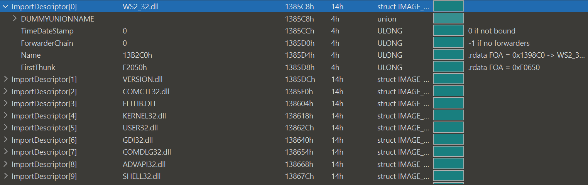
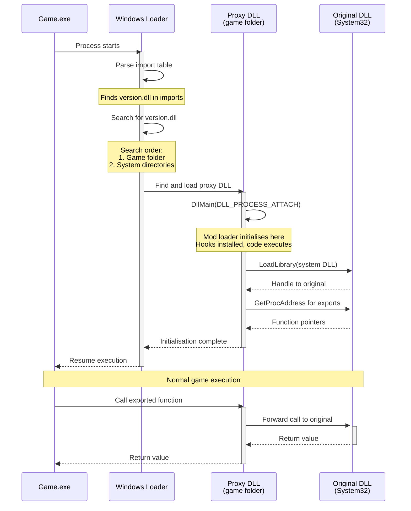
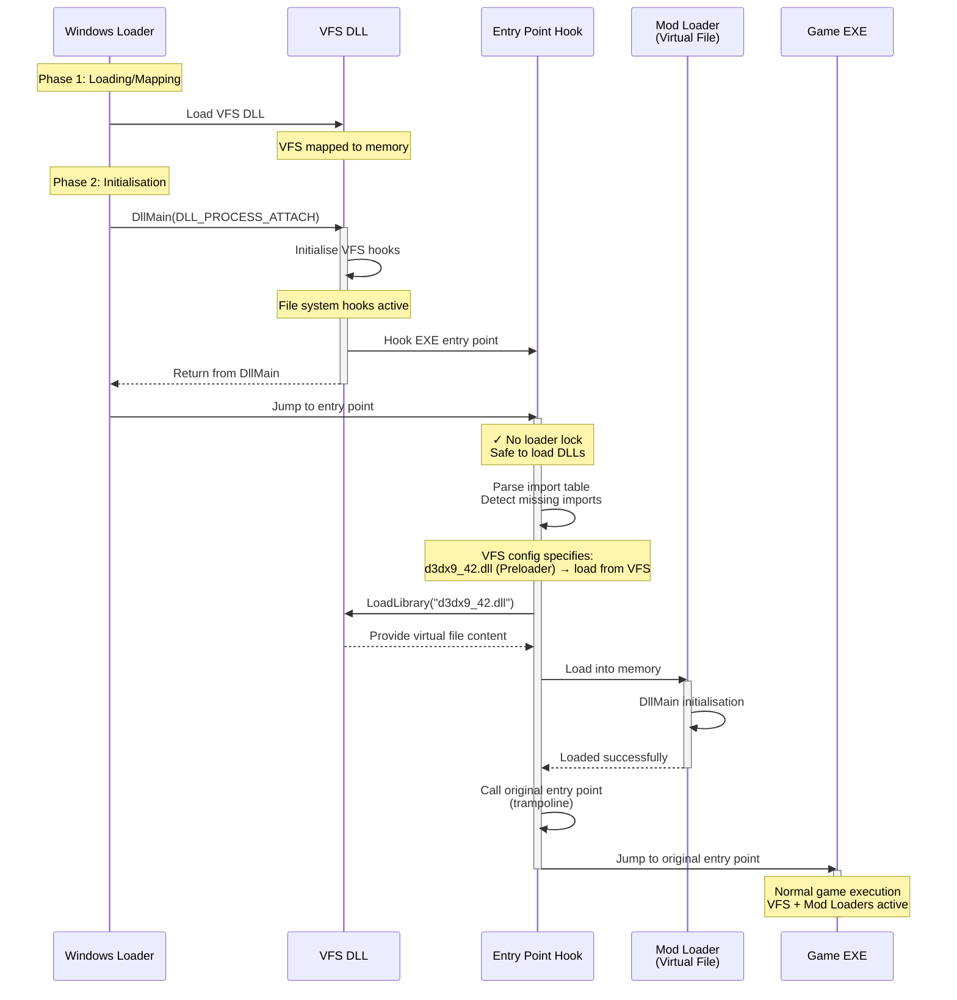

!!! note "Nexus Mods App & External Use Only"

    This page only concerns software like the Nexus Mods App, which needs to wrap external mod loaders with the VFS.<br/><br/>

    This does not apply to modding frameworks like Reloaded3.

# DLL Hijacking and Early Loading

Many game mod loaders utilise **DLL hijacking** as their primary injection mechanism.

This technique involves placing a DLL with a specific name in the game's directory, causing the
game to load the mod loader DLL instead of the legitimate system library.

!!! example "Common DLL Hijacking Targets"

    Popular DLL names used for hijacking include:
    
    - `version.dll` - Windows Version API
    - `winmm.dll` - Windows Multimedia API
    - `xinput1_3.dll` - Xbox Controller Input
    - `d3d9.dll` - Direct3D 9
    - `dinput8.dll` - DirectInput 8

When the game's executable imports one of these libraries, [Windows searches for DLLs in a specific order](https://learn.microsoft.com/en-us/windows/win32/dlls/dynamic-link-library-search-order#standard-search-order-for-unpackaged-apps).

By placing a proxy DLL in the game folder (which is searched before system directories), mod loaders can inject themselves into the game process.

## How DLL Hijacking Works

!!! info "PE Import Tables"
    Every PE file (executable or DLL) contains an **import table** listing its dependencies - the external DLLs and functions it requires.


/// caption
The PE import table structure listing external DLL dependencies.
///

When Windows loads a process, the loader parses this table and **loads each referenced DLL sequentially**.

- [Wine Source Code](https://github.com/wine-mirror/wine/blob/9250ecc5a6a64c73aada0ea751815412f7f00410/dlls/ntdll/loader.c#L1513-L1520)
- [ReactOS Source](https://github.com/mirror/reactos/blob/c6d2b35ffc91e09f50dfb214ea58237509329d6b/reactos/dll/ntdll/ldr/ldrpe.c#L626-L635)
- [Old Microsoft Blogs talk about Sequential Processing](https://learn.microsoft.com/en-us/archive/msdn-magazine/2002/march/windows-2000-loader-what-goes-on-inside-windows-2000-solving-the-mysteries-of-the-loader)

The loader searches for each DLL following [a specific search order](https://learn.microsoft.com/en-us/windows/win32/dlls/dynamic-link-library-search-order#standard-search-order-for-unpackaged-apps), checking the application directory before system folders. This sequential processing and search order enables DLL hijacking: by placing a proxy DLL in the game folder, it's found and loaded instead of the system version.



<div class="annotate" markdown>

1. **Windows Searches for DLLs**: The loader checks the game folder first, then system directories (1)
2. **Proxy DLL Loads**: The hijacking DLL in the game folder is found and loaded
3. **Mod Loader Initialises**: During `DllMain`, the proxy can install hooks, load plugins, or perform other initialisation tasks
4. **Original DLL Loaded**: The proxy loads the legitimate system DLL from its original location
5. **Function Forwarding Established**: The proxy obtains pointers to all the original DLL's exported functions
6. **Transparent Operation**: When the game calls DLL functions, the proxy forwards them to the original implementation

</div>

1. This search order is why placing a DLL in the game folder allows it to be loaded instead of the system version

This is how mod loaders gain early control of the process - before the main thread starts - whilst maintaining compatibility with games that legitimately require the hijacked DLL.

## The Load Order Problem

!!! info "Integration with External Modding Setups"

    In a good modding setup, all custom code that edits game behaviour (including VFS), would load as mods under a mod loader whose only primary responsibility is loading mods. Then sort by dependencies to ensure correct load order.

However in the ***Nexus Mods App***; we need to interact with all sorts of legacy modding solutions; which we have no control over; some sane, and some not so sane.

!!! info "Skyrim SE w/ SKSE is an example of one of these not-so-sane modding setups."

    ```mermaid
    flowchart TD

        SE[skse_loader64] -->|"Start Process #40;Suspended#41;"| A
        SE -->|"Init#40;#41;"| B{SKSE}

        A[Skyrim SE] -->|"Load via Import Table #40;d3dx9_42.dll#41;"| C
        C{Preloader} -. Implicit Dependency .-> B

        B -- load+init plugin --> PA{Plugin A \ne.g. Engine Fixes}
        B -- load+init plugin --> PB{Plugin B}
        B -- load+init plugin --> PC{Plugin C}

        C -- Preload --> PA{Plugin A e.g. Engine Fixes}
    ```

    SKSE acts as both a mod and a mod loader (❌ bad idea). When mods like Engine Fixes needed to run before SKSE's **mod** part, they had to make a mod loader for the mod loader (e.g. Preloader).

    And we... need to inject even before that.

    !!! note "I don't know how we got there; I'm not a Bethesda person, this is an outsider's POV."

Therefore in cases like the Nexus Mods App, we must get ahead of the `Preloader` in such a case.

When the first thread is started, the DLLs of the import table get loaded in- meaning that standard DLL Injection is a no-go.
We must either take control of loading the import table ourselves, hook onto the `Preloader`, or set up the game process ourselves.

## Understanding Windows Loader Phases

The Windows loader operates in two distinct phases, which is critical to understand when implementing early injection:

**Phase 1: Loading/Mapping (No DllMain yet!)**

1. `LdrpInitializeProcess` starts
2. `LdrpWalkImportDescriptor` walks EXE's import table:
    - Loads HookDLL -> Discovers HookDLL dependencies -> Loads them recursively
    - Loads DLL_B -> Discovers DLL_B dependencies (C, D) -> Loads them recursively
        - Loads DLL_C -> Loads C's dependencies recursively
        - Loads DLL_D -> Loads D's dependencies recursively
3. `LdrpSnapIAT` resolves all import tables
4. **ALL DLLs are now loaded and mapped (but no DllMain called yet)**

**Phase 2: Initialisation (DllMain calls happen here)**

5. `LdrpRunInitializeRoutines` calls DllMain in dependency order:
    - HookDLL.DllMain (YOUR HOOK INSTALLED HERE) ✓
    - C.DllMain (hook is active)
    - D.DllMain (hook is active)
    - B.DllMain (hook is active)
    - EXE entry point

This two-phase approach means that any hooks installed during `DllMain` can only intercept operations that happen **after** Phase 1 completes.

## Solution 1: PE Import Patching

!!! info "Simple Concept"
    Add our DLL as the first import inside the EXE, ensuring it gets loaded before anything else.

### How It Works

The PE format stores imported DLLs and their functions in the **Import Directory Table**. When Windows loads an executable:

1. It parses the import table sequentially
2. Loads each imported DLL in order
3. Resolves function addresses
4. Calls DLL entry points (`DllMain`)

!!! info "DllMain Call Order"
    The order follows the initialisation order list in the PEB, which is determined by:

    - Dependency relationships (dependencies are initialised before dependents) [Since Windows 10]
    - For independent DLLs, the order they appear in the import table

    You can find more about Windows loader behaviour differences (Windows 7 vs Windows 10) in this [handy Stack Overflow discussion](https://stackoverflow.com/questions/48302191/in-which-cases-is-the-dynamic-crt-not-already-initialized-on-call-to-user-suppli).

By injecting the VFS DLL as the **first entry** in the import table, we guarantee it loads before any hijacked DLLs.

```rust
// Conceptual example of PE import patching
fn patch_import_table(exe_path: &Path, vfs_dll_name: &str) -> Result<()> {
    // 1. Parse PE headers
    let pe = parse_pe_file(exe_path)?;
    
    // 2. Locate import directory
    let import_dir = pe.optional_header.data_directories.import_table;
    
    // 3. Create new import descriptor for VFS DLL
    let vfs_descriptor = ImportDescriptor {
        name: vfs_dll_name,
        original_first_thunk: 0, // No specific imports needed
        first_thunk: allocate_thunk_space()?,
    };
    
    // 4. Insert at the beginning of import table
    insert_import_descriptor_first(&mut pe, vfs_descriptor)?;
    
    // 5. Update PE headers and write back
    write_pe_file(exe_path, &pe)?;
    
    Ok(())
}
```

This patch can be done at runtime as part of DLL injection like in [Detours](https://github.com/microsoft/detours/wiki/DetourCreateProcessWithDlls), or by modifying the EXE on disk. Either works.

### Advantages

- **Guaranteed Load Order**: The VFS loads before any hijacked DLLs due to import table ordering.
- **Transparent to Game** (if modified EXE): No external launcher required; the game executable itself loads the VFS.
- **Persistent**: Once patched, the executable always loads the VFS first.
- **Deterministic**: The mod loaders/DLLs are using exactly as they were built for.
    - i.e. They use the intended DLL name, proxy the intended DLL, etc.

### Disadvantages (with EXE Patch)

- **File Modification Required**: The game executable must be modified.

- **Hashing**: The mod manager will need to maintain a map of pre-patch to post-patch hash, as to not return 'missing game files'.

### Disadvantage (with Runtime Patch)

The downside of runtime patching is that people have to launch the game via the injector (i.e. Nexus App).
This may annoy people using e.g. Steam Input, which requires Steam to launch the game to do its hooks.

### The Big Disadvantage: Mod Loader Must Still Exist on Disk

!!! danger "Files Must Exist on Disk"
    The original mod loader and its dependencies must exist in game folder, and cannot be virtual files.

This is because we can't install the hook fast enough. The PE loader (Windows loader) walks the import table and loads all dependencies **before** any `DllMain` is called (Phase 1). So the original mod loader and its dependencies will fail to resolve if they're only available through the VFS.

Bear in mind, this only affects Windows loading the DLL. Any code that's executed in there will go through VFS just fine.

!!! tip "Practical Workaround for 99.9% of Cases"
    If it's a DLL that goes to the EXE folder, and is in the import table, push it and rest of mod to disk. This ensures mod loaders are physically present when the Windows loader needs them during Phase 1.

## Solution 2: Loading Mod Loaders Manually

!!! success "Done This Before"
    This is what I did to load both Preloader and SKSE back in 2023 when testing my original VFS.

Solution 1 addresses load order but still requires mod loader files to exist on disk. This is because they're loaded during **Phase 1** (Loading/Mapping), before our VFS hooks become active in Phase 2.

However, we can solve this by **deferring** when these mod loaders are loaded. Instead of letting the Windows loader handle them during Phase 1, we load our VFS first, hook the game's entry point, and then manually load the mod loaders ourselves at that point.

This allows mod loaders to be **fully virtual files** provided by the VFS - they never need to exist on disk.

### How It Works

The approach can be split into two phases: detecting which mod loaders need to be loaded, and then loading them.

!!! tip "Automation Over Hardcoding"
    Detection could be done manually (hardcoding specific DLL names like `d3dx9_42.dll` or `skse64_loader.dll`), as we have done so far in the Nexus Mods App for various things like diagnostics, `WINEDLLOVERRIDES`, etc. (much to my dismay).
    
    Automating it makes the solution work for any mod loader and remains resilient to changes. Just because the wiki says something today doesn't mean it will say the same tomorrow.

#### Detecting the Loaders

<div class="annotate" markdown>

1. **Check Import Table of EXE** - We parse the game executable's PE import table to identify which DLLs it expects to load. (1)

2. **Compare to What Needs to Be Pushed to Disk** - For each imported DLL, we check if it will be pushed into the game folder. If it won't be pushed and isn't a system DLL (like kernel32.dll), it's likely a mod loader that we need to handle.

</div>

1. The PE import table is stored in the `IMAGE_IMPORT_DESCRIPTOR` array, accessible through the PE optional header's data directory.

3. **Export List of Mod Loader DLLs** - We export the list of mod loader DLLs to be loaded by VFS itself after it initialises. VFS will load this file to know which DLLs to provide as virtual files.

#### Loading the Loaders

!!! warning "Loader Lock Constraint"
    We should not load extra DLLs from `DllMain` due to the [loader lock](https://learn.microsoft.com/en-us/windows/win32/dlls/dynamic-link-library-best-practices) - calling `LoadLibrary` whilst the lock is held risks deadlock.
    
    Whilst we could use undocumented `LdrUnlockLoaderLock` and `LdrLockLoaderLock` to temporarily release the lock, that relies on implementation details. Better to do it from user code as intended.

<div class="annotate" markdown>

4. **Load VFS via Any Means** - We use any available method to get our VFS loaded first: DLL injection, PE Import Patching (Solution 1), or even a proxy DLL. The choice doesn't matter, as long as VFS is loaded and its hooks are active.

5. **Hook the EXE's Entry Point After VFS Initialises** - During our VFS `DllMain`, we hook the game executable's entry point. Hooking the entry point gives us a safe place to load DLLs after the loader lock is released.

6. **In Entry Point, Load Original DLLs in Original Order** - When our entry point hook executes, we manually call `LoadLibrary` for each detected mod loader DLL (e.g., Preloader, SKSE). The VFS intercepts these loads and provides the virtual file content. We must load them in the correct dependency order - dependencies before dependents - to ensure proper initialisation.

</div>



### Advantages

- **Fully Virtual Mod Loaders**: Mod loader DLLs can be 100% virtual files provided by the VFS. Only the VFS needs a file on disk.

- **Flexible VFS Loading**: Works regardless of how the VFS itself is loaded (PE Import Patching, DLL injection, or proxy DLL).

### Disadvantages

- **Non-Deterministic**: Mod loaders aren't being run in an environment they were built for. However, no side effects are expected with proxy loader DLLs being loaded not as proxies. (If there were, patches would be trivial.)

- **Needs Whitelist for Legit DLLs**: Legit DLLs which act not as proxy but as reimplementations of an API (e.g. d3d8to9, dxvk) still should be deployed as normal and loaded in place of the original, so we need a whitelist.

## Process Hollowing

!!! note "Process Hollowing (Not Pursued)"
    Process hollowing (also called **process replacement** or **RunPE**) involves setting up a process from scratch - essentially emulating `fork` on Windows. You create a suspended process, unmap its memory, and write your target executable into it. We can load a dummy EXE, load the VFS, then load the original EXE.

    ```rust
    // Conceptual example
    fn create_hollowed_process(target_exe: &Path, vfs_dll: &Path) -> Result<ProcessHandle> {
        // 1. Create suspended process
        let dummy_process = create_process_suspended("dummy.exe")?;
        
        // 2. Unmap the dummy's memory
        unmap_process_memory(dummy_process)?;
        
        // 3. Allocate memory for target executable
        let base_address = allocate_memory_in_process(
            dummy_process,
            target_exe.size(),
            PAGE_EXECUTE_READWRITE
        )?;
        
        // 4. Write target executable into the process
        write_process_memory(dummy_process, base_address, target_exe.data())?;
        
        // 5. Fix relocations
        apply_relocations(dummy_process, base_address, target_exe)?;
        
        // 6. Inject VFS DLL early
        inject_dll_into_process(dummy_process, vfs_dll)?;
        
        // 7. Set entry point and resume
        set_thread_context(dummy_process.main_thread(), target_exe.entry_point())?;
        resume_thread(dummy_process.main_thread())?;
        
        Ok(dummy_process)
    }
    ```

    Process hollowing doesn't give us much compared to patching the import table in a suspended process. It's also quite involved complexity-wise, so I'm not pursuing this further. Just noting it exists as an alternative approach.

## Open Questions

!!! question "Can We Insert Absolute Paths Into the Import Table?"
    If the PE import table supports absolute paths (e.g., `C:\VFS\vfs.dll`), then **PE Import Patching** could leave the game folder entirely untouched - the VFS DLL would live outside the game directory entirely.
    
    If not, we'd technically need to use **Process Hollowing** as described above, which is significantly more complex.
