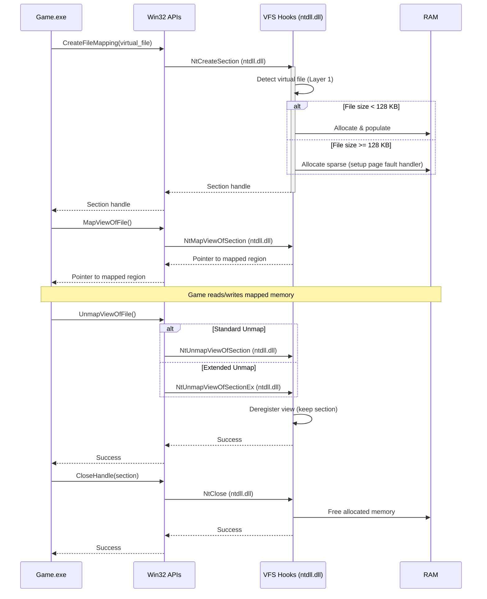

# Memory Map Hooking

!!! info "Layer 2 Only"
    
    **This is only needed for Layer 2 (Virtual Files).** For File Redirection (Layer 1), no action is needed.

## Introduction

Memory-mapped files map a file's contents directly into a process's virtual address space. Accessing an address triggers a **page fault**: the operating system automatically fetches the corresponding memory page from storage and populates it.

!!! question "Why Memory Map?"
    
    1. **Eliminates Extra Copy** - Traditional file I/O requires the kernel to copy data from storage into a kernel buffer, then copy again into the user's buffer. Memory mapping removes the intermediate step, reducing RAM bandwidth limitations at the cost of CPU overhead from handling page faults.
    2. **Convenience** - Access file content directly like RAM, simplifying code.

!!! note "Rare in Games"

    Memory-mapped files are rare in games. Decades of optical disc distribution shaped game I/O around sequential streaming, not random access. Modern engines prefer explicit asynchronous I/O (Win32 overlapped API, [DirectStorage](./DirectStorage.md)) over memory mapping. I (Sewer) have not yet seen a game that uses memory mapping.

The VFS must support memory mapping despite its rarity. The challenge: virtual files have no physical backing for `NtCreateSection`. The VFS must create legitimate section objects, intercept page faults during access, and synthesise content on-demand.

As an optimisation, small files (<128 KB) can be pre-populated in committed memory, avoiding page faults. Large files use sparse allocation: reserved address space with uncommitted pages, populated on-demand per page. Memory usage scales with accessed pages, not file size.

!!! info "128 KB Threshold"
    
    The 128 KB threshold is an arbitrary initial guess, subject to change based on profiling and real-world usage patterns.

## Windows Memory-Mapped File APIs

!!! info "The following APIs are involved in memory-mapped file operations."

Layer 2 must hook the `Nt*` variants to intercept virtual file operations:

| Operation               | API                      | Purpose                                                              |
| ----------------------- | ------------------------ | -------------------------------------------------------------------- |
| **Create Section**      | `NtCreateSection`        | Creates a section object for a file (primary hook point for Layer 2) |
| **Create Section (Ex)** | `NtCreateSectionEx`      | Extended version of NtCreateSection with additional flags            |
| **Map View**            | `NtMapViewOfSection`     | Maps a section into the process's virtual address space              |
| **Map View (Ex)**       | `NtMapViewOfSectionEx`   | Extended version with additional control over mapping                |
| **Unmap View**          | `NtUnmapViewOfSection`   | Unmaps a section from the process's virtual address space            |
| **Unmap View (Ex)**     | `NtUnmapViewOfSectionEx` | Extended unmap with additional flags                                 |
| **Close Handle**        | `NtClose`                | Closes section handles and triggers resource cleanup                 |
| **Flush View**          | `FlushViewOfFile`        | Flushes modified pages (relevant for page fault emulation)           |

And if we need to support writes, we will also need to touch:

| Operation             | API                 | Purpose                                                             |
| --------------------- | ------------------- | ------------------------------------------------------------------- |
| **Get Write Watch**   | `NtGetWriteWatch`   | Tracks which pages have been written (useful for hybrid strategies) |
| **Reset Write Watch** | `NtResetWriteWatch` | Clears write tracking for dirty page detection                      |

!!! info "Primary Hook Point"
    
    The critical hook point for Layer 2 is **`NtCreateSection`** (and its `Ex` variant). When the application calls `CreateFileMapping`, it ultimately calls `NtCreateSection`. This is where Layer 2 detects virtual files and synthesises section content.

A memory mapping on Windows usually looks something like this:

```c
// Open file (NtOpenFile in ntdll.dll)
HANDLE hFile = CreateFileW(L"data.bin", GENERIC_READ, FILE_SHARE_READ, NULL, OPEN_EXISTING, 0, NULL);

// Create section (NtCreateSection in ntdll.dll)
HANDLE hSection = CreateFileMappingW(hFile, NULL, PAGE_READONLY, 0, 0, NULL);

// Map view (NtMapViewOfSection in ntdll.dll)
void* pData = MapViewOfFile(hSection, FILE_MAP_READ, 0, 0, 0);

// Access memory (page faults trigger here if not committed)
uint8_t firstByte = ((uint8_t*)pData)[0];

// Unmap view (NtUnmapViewOfSection in ntdll.dll)
UnmapViewOfFile(pData);

// Close handles (NtClose in ntdll.dll)
CloseHandle(hSection);
CloseHandle(hFile);
```

## Implementation Overview

The VFS uses an **NT-only hooking strategy**, intercepting exclusively at the `ntdll.dll` level. Win32 APIs like `CreateFileMapping`, `MapViewOfFile`, and `UnmapViewOfFile` are thin wrappers that internally call NT APIs-hooking at the NT level provides complete coverage with a single interception point.

The following diagram illustrates how VFS intercepts memory-mapping operations:



<div class="annotate" markdown>

1. **VFS Detects Virtual File**: Hook intercepts `NtCreateSection` call (1)
2. **File Size Evaluation**: Checks whether to pre-populate or use page fault emulation (2)
3. **Memory Allocation**: Allocates memory-either fully populated or sparse with handler setup (3)
4. **Section Returned**: Returns valid section handle to caller (4)
5. **Mapping Succeeds**: Subsequent `MapViewOfSection` calls succeed, allowing the game to access virtual file content via memory pointers (5)

</div>

1. Detection uses the virtual file registry maintained by Layer 1
2. 128 KB threshold is arbitrary and subject to change
3. Size determined from file metadata; no disk I/O is performed
4. Allows subsequent `NtMapViewOfSection` to succeed without further modification
5. Game now has direct pointer access to synthesised file content

## The Five-Hook Lifecycle

!!! info "Five Hooks Are Mandatory"
    
    Implementing memory-mapped virtual files requires intercepting **five Windows NT APIs**. Each hook serves a distinct purpose, and all five are necessary for proper memory management and Windows compatibility.

### NtCreateSection Hook

!!! info "Primary detection point for virtual files"

When `CreateFileMapping` (Win32 API) is called, it invokes `NtCreateSection` (ntdll.dll) with the file handle.

**For all virtual files:**

1. **Detect Virtual Files**: Check if the handle corresponds to a virtual file using the Layer 1 registry
2. **Track Section Handle**: Store the section handle for subsequent hooks

**File size determines allocation behaviour:**

- **Small files (< 128 KB)**: Allocate committed memory with `VirtualAlloc(MEM_COMMIT | MEM_RESERVE)`, populate with synthesised content, and create an anonymous section backed by the memory
- **Large files (≥ 128 KB)**: Allocate backing storage with `VirtualAlloc(MEM_RESERVE, PAGE_NOACCESS)` for the ENTIRE file-all views will reference this single allocation

!!! example "Detection and Allocation"
    ```rust
    unsafe extern "system" fn nt_create_section_detour(
        section_handle: *mut HANDLE,
        file_handle: HANDLE,
        ...
    ) -> NTSTATUS {
        if is_virtual_file(file_handle) {
            let file_size = get_virtual_file_size(file_handle);
            
            if file_size < 128 * 1024 {
                // Small file: allocate & populate immediately
                let memory = VirtualAlloc(None, file_size, MEM_COMMIT | MEM_RESERVE, PAGE_READWRITE);
                synthesise_file_content(file_handle, memory, file_size);
                let section = create_anonymous_section(memory, file_size);
                track_section(section, memory);
            } else {
                // Large file: allocate backing storage for the ENTIRE file (all views will reference this)
                let backing_storage = VirtualAlloc(None, file_size, MEM_RESERVE, PAGE_NOACCESS);
                let section = create_anonymous_section_handle();
                track_section(section, backing_storage); // Section handle → backing storage mapping
            }
            
            *section_handle = section;
            return STATUS_SUCCESS;
        }
        
        original_nt_create_section(...)
    }
    ```
    
    !!! warning "Section Handle Must Be Windows-Assigned"
        
        `create_anonymous_section` and `create_synthetic_section_handle` must return a **Windows-assigned handle** to prevent potential duplicates with Windows-managed handles.
        
        To achieve this, open a handle to a null/empty/anonymous section using the original `NtCreateSection`, then intercept all subsequent APIs for that handle. This ensures the handle is legitimate and won't conflict with other system handles.

### NtMapViewOfSection Hook

!!! info "Maps the section into the process's address space"

Behaviour differs based on file size:

**For small files (pre-populated):**

1. **Return Base Address**: Set `base_address` to `memory_base + section_offset` (accounting for offset if provided)
2. **Track Mapping**: Store the mapping in a registry for cleanup

**For large files (page fault emulation):**

1. **Retrieve Backing Storage**: Get backing storage base address from section handle
2. **Calculate View Address**: Compute view address as `backing_storage + section_offset` (pointer arithmetic into existing allocation)
3. **Register Exception Range**: Add the backing storage address range to the vectored exception handler's tracking structure (only if not already registered)
4. **Track View Metadata**: Store view metadata including view address, size, section handle, and offset

!!! info "Shared Backing Storage Architecture"
    
    The section's backing storage is allocated in `NtCreateSection`. This hook returns pointers into that existing allocation, allowing multiple views to share the same underlying pages. Pages committed in the backing storage are visible to ALL views.

### NtUnmapViewOfSection and NtUnmapViewOfSectionEx Hooks

When `UnmapViewOfFile` (or its variants) is called, it invokes either `NtUnmapViewOfSection` or `NtUnmapViewOfSectionEx`. Both hooks perform identical operations.

**For all virtual files:**

1. **Identify Virtual Mappings**: Check if the view address is tracked in view metadata
2. **Remove View Tracking**: Remove the view from the view metadata registry
3. **Do Not Free Memory**: Backing storage must persist until the section handle is closed

**Additionally, for large files only:**

- **Deregister Exception Range**: Remove the backing storage address range from the vectored exception handler's tracking structure (only if this is the last view for the section)

!!! warning "Section Lifetime Independence"
    
    Section objects have **independent lifetimes** from their mapped views. A single section can have multiple views created, unmapped, and remapped. Memory allocated during section creation must **not** be freed during view unmapping.

### NtClose Hook

The `NtClose` hook is the **critical cleanup point** for resource deallocation. When a section handle is closed:

1. **Identify Section Handles**: Check if the handle corresponds to a tracked virtual section
2. **Free Backing Storage**: Call `VirtualFree(MEM_RELEASE)` to deallocate the ONE backing storage allocation created in `NtCreateSection` (all views of the section shared this backing storage during their lifetime)
3. **Remove All View Metadata**: Clean up any remaining view tracking entries for this section
4. **Remove Section Tracking**: Remove the section from the tracking registry

!!! warning "Memory Leak Prevention"
    
    This hook is the **only** correct place to free allocated memory. Failing to hook `NtClose` will leak memory for every virtual file section created. The five-hook lifecycle is mandatory: `NtCreateSection` → `NtMapViewOfSection` → `NtUnmapViewOfSection`/`NtUnmapViewOfSectionEx` → `NtClose`.

## Page Fault Handling

!!! info "For large files (≥ 128 KB), the VFS uses page fault emulation to populate memory on-demand"

When the application accesses an uncommitted page in reserved address space, the CPU triggers an `EXCEPTION_ACCESS_VIOLATION`. A `VectoredExceptionHandler` intercepts this exception, commits the page, synthesises content, and returns control to retry the faulting instruction.

### Registering the Exception Handler

!!! info "Register once during VFS initialisation using `AddVectoredExceptionHandler`"

This handler receives first-chance exceptions process-wide, allowing transparent interception without application awareness.

```rust
// Called once during VFS initialisation
unsafe fn initialise_page_fault_handler() {
    let handler = AddVectoredExceptionHandler(1, Some(exception_handler));
    // Store handler for cleanup on shutdown
}
```

### Exception Handler Lifecycle

When the application accesses an uncommitted page:

1. **Exception Triggered**: CPU raises `EXCEPTION_ACCESS_VIOLATION` with the faulting address
2. **Verify Address**: Check if the fault address is in a tracked range (if not, return `EXCEPTION_CONTINUE_SEARCH` to pass to other handlers)
3. **Calculate Page Number**: `page_num = (fault_addr - base_addr) / PAGE_SIZE`
4. **Commit Page**: `VirtualAlloc(page_start, PAGE_SIZE, MEM_COMMIT, PAGE_READWRITE)`
5. **Synthesise Content**: Invoke Layer 2 handler to populate the page
6. **Return**: `EXCEPTION_CONTINUE_EXECUTION` to retry the faulting instruction - now succeeds transparently

!!! example "Exception Handler Implementation"
    ```rust
    unsafe extern "system" fn exception_handler(info: *mut EXCEPTION_POINTERS) -> i32 {
        // Only handle access violations
        if (*(*info).ExceptionRecord).ExceptionCode != EXCEPTION_ACCESS_VIOLATION {
            return EXCEPTION_CONTINUE_SEARCH;
        }
        
        let fault_addr = (*(*info).ExceptionRecord).ExceptionInformation[1];
        let ranges = EXCEPTION_RANGES.lock().unwrap();
        
        // Find tracked range containing fault address
        let (&base_addr, &(size, section)) = ranges.iter()
            .find(|(&&base, &(size, _))| fault_addr >= base && fault_addr < base + size)?;
        drop(ranges);
        
        // Calculate page number and commit
        let page_num = (fault_addr - base_addr) / PAGE_SIZE;
        let page_start = base_addr + (page_num * PAGE_SIZE);
        let result = VirtualAlloc(
            Some(page_start as *const c_void), 
            PAGE_SIZE, 
            MEM_COMMIT, 
            PAGE_READWRITE
        );
        
        if result.is_null() {
            return EXCEPTION_CONTINUE_SEARCH;
        }
        
        // Synthesise content for this page
        synthesise_page_content(section, page_num, result);
        
        EXCEPTION_CONTINUE_EXECUTION
    }
    ```

### Implementation Considerations

**VEH vs SEH**: Vectored Exception Handlers are process-wide and receive exceptions before Structured Exception Handling. This allows the VFS to intercept page faults transparently across all threads.

**Thread Safety**: The exception handler can fire from any thread at any time. All tracking structures (`EXCEPTION_RANGES`) must be protected with locks.

**Multiple Mappings**: The VFS can track multiple virtual file mappings simultaneously. Address ranges must not overlap to ensure correct fault attribution.

!!! tip "Non-Overlapping Ranges Guaranteed by Windows"
    
    When using `VirtualAlloc(None, size, MEM_RESERVE, ...)` without specifying a base address, Windows automatically guarantees non-overlapping address ranges. The memory manager will never return an address that conflicts with existing allocations. This property is provided for free by the OS.

**Performance**: Page fault overhead with Vectored Exception Handlers is unknown. First access incurs exception handling plus synthesis cost; subsequent accesses are standard memory reads. Sequential patterns likely need prefetching to amortise overhead.

**Memory Eviction**: Under memory pressure, must manually evict pages using `VirtualFree(MEM_DECOMMIT)` - Windows cannot automatically evict pages from our reserved regions.

## Proof of Concept Examples

The `examples/` folder contains proof of concept implementations for different file sizes:

- **`examples/mmap-pre-populate`**: Small file path (< 128 KB) - pre-populated committed memory
- **`examples/mmap-page-fault`**: Large file path (≥ 128 KB) - page fault emulation with `VectoredExceptionHandler`

Both examples demonstrate the same five-hook lifecycle:

- NT-level hooking (`NtCreateSection`, `NtMapViewOfSection`, `NtUnmapViewOfSection`, `NtUnmapViewOfSectionEx`, `NtClose`)
- Section lifetime management (handle tracking, view tracking, memory deallocation)
- Basic `section_offset` support (simplified for educational purposes)

!!! warning "PoC Limitations"
    
    The examples are **proof of concept** implementations demonstrating core concepts. There's a lot of stuff missing:
    
    - Offset alignment validation (64 KB for file-backed sections, PAGE_SIZE for reserved memory)
    - Bounds checking (`offset + view_size <= file_size`)
    - Robust error handling and cleanup (our errors should match actual ntdll ones)
    - Performance optimisations (batch page commits, read-ahead)
    - Page eviction on low memory
    - Any other edge cases

## Open Questions

- **What is the optimal threshold?** The 128 KB split between pre-population and page fault emulation needs profiling.

- **How much overhead does VectoredExceptionHandler add?** Precise measurements needed for page fault latency under various loads (single-threaded, multi-threaded, high contention).

- **How do we handle write-mapped sections?** Supporting `PAGE_READWRITE` sections requires dirty page tracking (`NtGetWriteWatch`, `NtResetWriteWatch`) and write-back logic.
