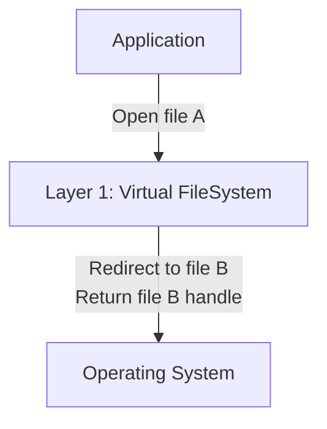
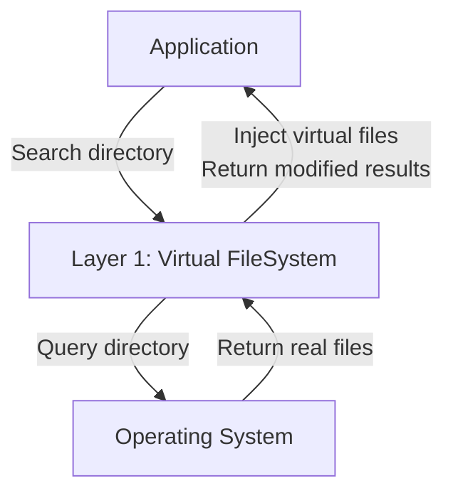
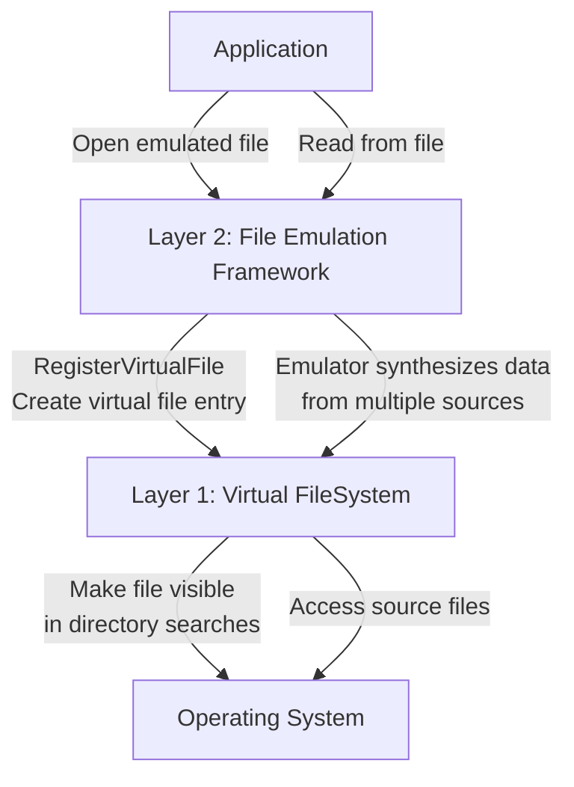

!!! info "About This Documentation"
	Forked and improved from the [Reloaded3 Specification](https://reloaded-project.github.io/Reloaded-III/Mods/Essentials/Virtual-FileSystem/About.html). May upstream back to R3 docs, or reuse in actual project.

# User Space Virtual Filesystems

This wiki describes the implementation details of a **two-layer architecture** for implementing a Virtual FileSystem suitable for modding games.

## Implementation Overview

The architecture separates concerns into two distinct layers, each with specific responsibilities:

!!! warning "Logical Layer Separation"

    These layers represent logical ***architectural boundaries***, not necessarily separate binaries or libraries.
    
    Simply, don't mix Layer 1 & 2 code, or you'll make a mess of it; put them in separate files
    or projects!

    Keep Layer 1 code focused on path operations and Layer 2 code focused on data synthesis.

### Layer 1: Virtual FileSystem

!!! info "This handles the 'where' problem"

    Layer 1 focuses on path redirection and virtual file visibility.

- **Path redirection** - Make the OS open file B when the application asks for file A
- **Virtual file injection** - Make files appear in directory listings even if they don't exist on disk
- **Metadata spoofing** - Return correct file attributes and sizes for redirected/virtual files

Layer 1 operates at the path/metadata level. It doesn't care about file contents, only about routing requests to the right location and making virtual files visible.

**[Complete Implementation Details →](Virtual-FileSystem/About.md)**

#### Layer 1 Key APIs

- **`AddRedirect(sourcePath, targetPath)`** - Redirect individual file paths.

- **`RemoveRedirect(handle)`** - Remove an individual redirect.

- **`AddRedirectFolder(sourceFolder, targetFolder)`** - Overlay entire folder structure. Files in targetFolder appear in sourceFolder.

- **`RemoveRedirectFolder(handle)`** - Remove a folder overlay.

And this private API:

- **`RegisterVirtualFile(path, metadata)`** - Make a virtual file visible in directory searches. Layer 2 calls this to register virtual files so they appear when games search directories.

- **`UnregisterVirtualFile(handle)`** - Remove a virtual file from directory search results.

### Layer 2: Virtual File Framework

!!! info "This handles the 'what' problem"

    Layer 2 is all about handling access to the files returned by Layer 1.
    Providing custom data as it's read, keeping track of file seeks, etc.

Layer 2 deals with all of the events that happen to a ***virtual*** file once
it's been opened. The extensions in Layer 3 can create virtual files through Layer 2's API,
and Layer 2 will handle all of the interactions with the operating system for that file.

***Layer 2 is an abstraction*** for the extensions in Layer 3.

#### Layer 2 Key APIs

- **`RegisterVirtualFile(path, metadata, fileHandler)`** - Allows extensions to create virtual files that Layer 1 will make visible in directory searches. The `metadata` is immutable metadata about file (e.g. size), the `fileHandler` parameter is an object that implements methods for handling read operations.

### Layer 3: Extensions

!!! info "About Layer 3"

    Layer 3 forms the extensions that are built on top of Layers 1 & 2.
    Those can be thought of as 'plugins' that implement specific behaviours.

#### Example Extension: Nx2VFS

**Nx2VFS** is a practical implementation that uses Layer 2 to provide an archive-backed filesystem. Games see normal files on disk, but they're actually backed by compressed `.nx2` archives containing multiple files.

In this case, Nx2VFS would call Layer 2's `RegisterVirtualFile()` for each file contained in the original `.nx2` archive. And a `fileHandler` implementation to fill in the actual data.

#### Example Extension: Archive Emulation Framework


### Layer Interaction

Both layers work by hooking low-level `ntdll.dll` APIs on Windows.

??? question "Why ntdll.dll specifically?"
    `ntdll.dll` is the lowest-level user-mode library on Windows, sitting directly above the kernel. All higher-level file I/O APIs funnel through these ntdll functions:
    
    - Win32 APIs (`CreateFileW`, `ReadFile`) → `kernel32.dll` → `ntdll.dll`
    - C Runtime (`fopen`, `fread`) → `ucrtbase.dll` → `kernel32.dll` → `ntdll.dll`  
    - C++ STL (`std::ifstream`) → CRT → `kernel32.dll` → `ntdll.dll`
    
    By hooking at the ntdll level, we intercept **all** file operations from any software on Windows. This works because Windows does not have stable syscalls; all user-mode software must use OS provided APIs, which pass through `ntdll.dll` to communicate with the kernel counterparts, e.g. `NtOpenFile` -> `ZwOpenFile`.
    
    This single interception point also works with Wine on Linux, since `Wine` aims to implement Win32 as closely as possible; and that includes its relationship between `kernel32.dll` and `ntdll.dll`.

Layer 2 depends on Layer 1's API but not vice versa:

- **Layer 1** hooks path/metadata operations (`NtOpenFile`, `NtQueryDirectoryFile`, `NtQueryAttributesFile`, etc.)
- **Layer 2** hooks data operations (`NtReadFile`, `NtSetInformationFile`, etc.) and calls Layer 1's `RegisterVirtualFile()` API
- Applications remain completely unaware of both layers

**Layer 1 Only (Path Redirection & Virtual Files):**

**Path Redirection:**



**Virtual File Injection:**



**Layer 1 + Layer 2 (Data Synthesis & Virtual Files):**



---

## Layer 1: Virtual FileSystem

### What It Does

Intercepts file open operations to redirect path A → path B.  
Intercepts directory query operations to inject virtual file entries into search results.

When an application tries to open `game/data.pak`, Layer 1 can transparently open `mods/mymod/data.pak` instead. The application receives a handle to the substituted file with no awareness of the redirection.

### Hooked APIs

- **`NtCreateFile`** - Intercept file creation operations. Check if path should be redirected when creating new files. Substitute with target path before calling original API.

- **`NtOpenFile`** - Intercept file open operations. Check if path should be redirected when opening existing files. Substitute with target path before calling original API.

- **`NtQueryDirectoryFile`** - Inject virtual files into directory search results (pre-Windows 10 / Wine). When application searches a directory, inject registered virtual files into the result set.

- **`NtQueryDirectoryFileEx`** - Inject virtual files into directory search results (Windows 10+). On Windows 10+, this is the primary API. Both APIs are hooked with recursion detection.

- **`NtQueryAttributesFile`** - Return metadata for virtual/redirected files. When application queries basic file attributes, return data for the redirected or virtual file.

- **`NtQueryFullAttributesFile`** - Return full metadata for virtual/redirected files. When application queries extended file attributes (size, timestamps, etc.), return data for the redirected or virtual file.

- **`NtDeleteFile`** - Handle deletion operations on virtual/redirected files. Intercept deletion requests and handle appropriately.

- **`NtClose`** - Track when file handles are closed. Used for internal handle lifecycle management.

**[→ Complete Hook Flow Diagram](Virtual-FileSystem/Implementation-Details/Hooks.md)**

### Implementation Notes

- Uses **path tree structures** for efficient redirect lookup
- Virtual files stored in **hash table** keyed by normalized path
- All path comparisons are **case-insensitive** on Windows
- Redirect priority: individual file redirects take precedence over folder redirects
- Supports merging multiple source folders onto a single target (last registered wins for conflicts)
- Works with Wine on Linux (all Win32 APIs funnel through ntdll)

**[→ Full Implementation Details](Virtual-FileSystem/About.md)**

---

## Layer 2: File Emulation Framework

### What It Does

Synthesizes file data on-the-fly by intercepting read operations. Instead of returning data from disk, Layer 2 generates the file content dynamically by merging data from multiple sources.

Uses Layer 1 to make emulated files visible in directory searches and to handle path routing.

### Hooked APIs

- **`NtCreateFile` & `NtOpenFile`** - Detect when an emulated file is being opened. Match the file path against registered emulator routes. If matched, call into the emulator's `try_create_file` method to initialize emulator state and create internal data structures for synthesizing the file.

- **`NtReadFile`** - Intercept file read operations. If the file is being emulated, use the StreamSlice array to determine where data comes from. Read from source files/locations and return synthesized data instead of the original file data.

- **`NtSetInformationFile`** - Intercept handle update operations. Track file pointer position updates (seek operations). Emulated files need to maintain their own file pointer state so that read operations know where to read from.

- **`NtQueryInformationFile`** - Intercept file information queries. Report the emulated file's size and attributes. The emulated file size may differ from the original file on disk.

- **`NtQueryFullAttributesFile`** - Intercept file attribute queries. Report the emulated file's size and full attributes. Used when applications check file metadata without opening the file.

- **`NtClose`** - Intercept file close operations. Dispose of emulator internal state for the emulated file (such as current read offset). Free internal data structures for that emulated file instance.

**[→ Complete Hook Details](File-Emulation-Framework/Implementation-Details/Hooks.md)**

### Dependencies on Layer 1

- Calls `RegisterVirtualFile()` to make emulated files visible in directory listings
- Leverages Layer 1's redirect system for route-based file targeting
- Layer 1 handles the path redirection; Layer 2 handles the data synthesis

### Route System

Files are identified by their full path including archive nesting:

```
<GameFolder>/English/Sound.afs/00000.adx
            └─ Archive ─┘ └─ File Inside ─┘
```

Emulators match against routes using partial path matching. A route pattern like `Sound.afs/00000.adx` matches any path ending with that pattern. More specific patterns take precedence:

- `English/Sound.afs/00000.adx` matches only files in the English folder
- `Sound.afs/00000.adx` matches Sound.afs in any folder

This allows precise targeting of files inside archives without requiring full absolute paths.

### Emulator Chaining

Emulators can operate on files inside other emulated files. For example:

```
FileEmulationFramework/
  ONE/
    textures.one/
      textures.txd          ← Inject textures.txd into textures.one archive
  TXD/
    textures.txd/
      texture_001.dds       ← Inject texture into textures.txd (which is inside .one)
```

When the game opens `textures.one`, the ONE emulator emulates it. When it reads `textures.txd` from inside, the TXD emulator emulates that. Routes compose naturally through the path hierarchy.

### Data Structures

**Emulated File Tracking:**

- Hash table keyed by **file handle** (`HANDLE` on Windows)
- Value contains emulator instance state for that specific file

**StreamSlice Array:**

Each emulated file contains an array of `StreamSlice` objects representing where data comes from:

```rust
struct StreamSlice {
    offset: u64,      // Where in emulated file this data appears
    length: u64,      // How much data this slice provides
    source: Source,   // Where to read data from
}

enum Source {
    File { handle: HANDLE, offset: u64 },  // Read from another file
    Memory { ptr: *const u8 },              // Read from memory
    Zeros,                                   // Return zeros (padding)
}
```

For each read operation:

1. Binary search the StreamSlice array to find which slice(s) cover the requested range
2. For each slice, read from the appropriate source
3. Combine the data and return to application

**Performance Characteristics:**

- Hash table lookup: ~8ns (constant time)
- Binary search on StreamSlice array: 2.5-5.5ns for <64 slices, 35ns for 16384 slices (logarithmic)
- Total overhead per read: ~15ns for typical files

### Implementation Notes

- **Zero-copy when possible:** If reading entire file from single source, can pass through directly
- **Lazy initialization:** Emulator state created only when file is actually opened
- **Route matching:** Uses suffix matching on normalized paths
- **Priority system:** More specific routes take precedence over generic ones
- **Thread safety:** Each file handle has independent state; thread-safe for concurrent operations on different handles

**[→ Full Implementation Details](File-Emulation-Framework/About.md)**

---

## How does this compare with my previous work?

!!! info "Production-Tested Foundation"

    The architecture described here builds upon the one in Reloaded-II; which have been used in production for a few years.

This documentation iterates and improves upon two major implementations:

### FileEmulationFramework (Reloaded-II)

**[FileEmulationFramework](https://github.com/Sewer56/FileEmulationFramework)** is the reference implementation for the Layer 2 architecture (with built in Layer 3 plugin). Actively used in production since 2022, across several archive formats and games. An iteration of another project of mine from 2020.

### reloaded.universal.redirector

**reloaded.universal.redirector** implements the Layer 1 architecture with comprehensive read operation support in the unreleased `rewrite-usvfs-read-features` branch (1). Original simpler file open hook actively used in production since 2019.
{ .annotate }

1.  Fully working and complete, including on Wine, but unreleased due to certainty it would break with future .NET Runtime upgrades from problems involving GC transitions.<br/><br/>A certain case in Wine already reproduced the inevitable.

### Key Architectural Difference

**Emulated File Generation: Access Time vs Up Front**

In Reloaded-II, emulated files were created **at access time** (lazy initialization). This is because, at the time the original `FileEmulationFramework` was written, the primary use case was replacing original game files (e.g. archives) with emulated versions when the game accessed them. 

!!! example "Example: Replace 60GB archive with new 60GB archive, without using disk space."

Over time, a need emerged for artificial emulated files; ones not tied to any original game file. (Think making an extra file and appending it to a list of files game would load).

APIs were added to support this, but it introduced a situation where some files were created lazily, while others were created up front. 

The current design (Reloaded3) generates **all emulated files up front** rather than at access time. What this means in the context of a 


This simplification reduces overhead at file open time, makes the virtual filesystem state predictable through an explicit registration phase, and provides better performance characteristics for bulk operations. The trade-off of marginal memory savings for lazy initialization wasn't worth the implementation complexity in production use.
