!!! info "About This Documentation"
	Forked and improved from the [Reloaded3 Specification](https://reloaded-project.github.io/Reloaded-III/Mods/Essentials/Virtual-FileSystem/About.html). May upstream back to R3 docs, or reuse in actual project.

# User Space Virtual Filesystems

This wiki describes the implementation details of a **two-layer architecture** for implementing a Virtual FileSystem suitable for modding games.

## Implementation Overview

The architecture separates concerns into two distinct layers, each with specific responsibilities:

!!! warning "Logical Layer Separation"

    These layers represent logical ***architectural boundaries***, not necessarily separate binaries or libraries.
    
    Simply, don't mix Layer 1 & 2 code, or you'll make a mess of it; put them in separate files
    or projects!

    Keep Layer 1 code focused on path operations and Layer 2 code focused on data synthesis.

### Layer 1: Virtual FileSystem

!!! info "This handles the 'where' problem"

    Layer 1 focuses on path redirection and virtual file visibility.

- **Path redirection** - Make the OS open file B when the application asks for file A
- **Virtual file injection** - Make files appear in directory listings even if they don't exist on disk
- **Metadata spoofing** - Return correct file attributes and sizes for redirected/virtual files

Layer 1 operates at the path/metadata level. It doesn't care about file contents, only about routing requests to the right location and making virtual files visible.

i.e. **Layer 1** hooks path/metadata operations (`NtOpenFile`, `NtQueryDirectoryFile`, `NtQueryAttributesFile`, etc.)

**[Complete Implementation Details →](Virtual-FileSystem/About.md)**

#### Layer 1 Key APIs

- **`AddRedirect(sourcePath, targetPath)`** - Redirect individual file paths.

- **`RemoveRedirect(handle)`** - Remove an individual redirect.

- **`AddRedirectFolder(sourceFolder, targetFolder)`** - Overlay entire folder structure. Files in targetFolder appear in sourceFolder.

- **`RemoveRedirectFolder(handle)`** - Remove a folder overlay.

And this private API:

- **`RegisterVirtualFile(path, metadata)`** - Make a virtual file visible in directory searches. Layer 2 calls this to register virtual files so they appear when games search directories.

- **`UnregisterVirtualFile(handle)`** - Remove a virtual file from directory search results.

### Layer 2: Virtual File Framework

!!! info "This handles the 'what' problem"

    Layer 2 is all about handling access to the files returned by Layer 1.
    Providing custom data as it's read, keeping track of file seeks, etc.

Layer 2 deals with all of the events that happen to a ***virtual*** file once
it's been opened. The extensions in Layer 3 can create virtual files through Layer 2's API,
and Layer 2 will handle all of the interactions with the operating system for that file.

***Layer 2 is an abstraction*** for the extensions in Layer 3.

i.e. **Layer 2** hooks data operations (`NtReadFile`, `NtSetInformationFile`, etc.) and calls Layer 1's `RegisterVirtualFile()` API

#### Layer 2 Key APIs

These are public versions of Layer 1's private APIs:

- **`RegisterVirtualFile(path, metadata, fileHandler)`** - Allows extensions to create virtual files that Layer 1 will make visible in directory searches. The `metadata` is immutable metadata about file (e.g. size), the `fileHandler` parameter is an object that implements methods for handling read operations.

- **`UnregisterVirtualFile(handle)`** - Removes a virtual file registered earlier.

### Layer 3: Extensions

!!! info "About Layer 3"

    Layer 3 forms the extensions that are built on top of Layers 1 & 2.
    Those can be thought of as 'plugins' that implement specific behaviours.

#### Example Extension: Archive Emulation Framework

!!! info "Originally part of Reloaded-II's `FileEmulationFramework`"

The **Archive Emulation Framework** allows injecting files into game archives without writing code, using supported archive emulators that are built on top of the framework.

It provides a declarative way to modify archive contents by simply placing files in specific folder structures.

##### Route System

Files are identified by their full path including archive nesting:

```
<GameFolder>/English/Sound.afs/00000.adx
                    └ Archive ┘└ File Inside ┘
```

Emulators match against routes using partial path matching. A route pattern like `Sound.afs/00000.adx` matches any path ending with that pattern. More specific patterns take precedence:

- `English/Sound.afs/00000.adx` matches only files in the English folder
- `Sound.afs/00000.adx` matches Sound.afs in any folder

This allows precise targeting of files inside archives without requiring full absolute paths.

##### Emulator Chaining

Emulators can operate on files inside other emulated files. For example:

```
FileEmulationFramework/
  ONE/
    textures.one/
      textures.txd          ← Inject textures.txd into textures.one archive
  TXD/
    textures.txd/
      texture_001.dds       ← Inject texture into textures.txd (which is inside .one)
```

When the game opens `textures.one`, the ONE emulator emulates it. When it reads `textures.txd` from inside, the TXD emulator emulates that. Routes compose naturally through the path hierarchy. i.e. The system works recursively.

!!! info "TODO: Document Emulator Chaining/Nesting without Dummy Files"

    There's some solution in use today, I forgot the details.

#### Example Extension: Nx2VFS

**Nx2VFS** is a practical implementation that uses Layer 2 to provide an archive-backed filesystem. Games see normal files on disk, but they're actually backed by compressed `.nx2` archives containing multiple files.

In this case, Nx2VFS would call Layer 2's `RegisterVirtualFile()` for each file contained in the original `.nx2` archive. And a `fileHandler` implementation to fill in the actual data.

**How Nx2VFS Works:**

```
Archive on Disk:                    What Games See:
┌──────────────────┐                ┌──────────────────────────┐
│  game.nx2        │  Nx2VFS        │  game/                   │
│  ├─ player.model │ ──────────────▶│  ├─ player.model         │
│  ├─ enemy.model  │  registers     │  ├─ enemy.model          │
│  └─ level.map    │  each file     │  └─ level.map            │
└──────────────────┘                └──────────────────────────┘
    (compressed)                    (appear as normal files)
```

**Creating Virtual Files:**

```
┌─────────────────────────────────────────────────────────────────┐
│ Nx2VFS Extension (Layer 3)                                      │
└─────────────────────────────────────────────────────────────────┘
                          │
                          │ 1. Parse game.nx2
                          │    Discover: player.model, enemy.model, level.map
                          ▼
        ┌─────────────────────────────────────────┐
        │ For each file in archive:               │
        │                                         │
        │  RegisterVirtualFile(                   │
        │    path:        "game/player.model"     │
        │    metadata:    {size: 1024, ...}       │
        │    fileHandler: Nx2FileHandler          │
        │  )                                      │
        └─────────────────────────────────────────┘
                          │
                          ▼
┌─────────────────────────────────────────────────────────────────┐
│ Layer 2: Virtual File Framework                                 │
│ • Stores fileHandler reference                                  │
│ • Calls Layer 1's RegisterVirtualFile(path, metadata)           │
└─────────────────────────────────────────────────────────────────┘
                          │
                          ▼
┌─────────────────────────────────────────────────────────────────┐
│ Layer 1: Virtual FileSystem                                     │
│ • Adds "game/player.model" to virtual file registry             │
│ • Files now appear in directory listings                        │
└─────────────────────────────────────────────────────────────────┘
```

**Resolving Reads:**

```
When game opens 'game/player.model':
  1. Layer 2 intercepts the read (NtReadFile)
  2. Layer 2 calls Nx2VFS's fileHandler
  3. fileHandler locates data inside game.nx2
  4. fileHandler decompresses and returns data
  5. Layer 2 passes data back to game
```

## Hook Endpoints (Windows)

Both layers work by hooking low-level `ntdll.dll` APIs on Windows.

!!! question "Why ntdll.dll specifically?"

    `ntdll.dll` is the lowest-level user-mode library on Windows, sitting directly above the kernel. All higher-level file I/O APIs funnel through these ntdll functions:
    
    - Win32 APIs (`CreateFileW`, `ReadFile`) → `kernel32.dll` → `ntdll.dll`
    - C Runtime (`fopen`, `fread`) → `ucrtbase.dll` → `kernel32.dll` → `ntdll.dll`  
    - C++ STL (`std::ifstream`) → CRT → `kernel32.dll` → `ntdll.dll`
    
    By hooking at the ntdll level, we intercept **all** file operations from any software on Windows. This works because Windows does not have stable syscalls; all user-mode software must use OS provided APIs, which pass through `ntdll.dll` to communicate with the kernel counterparts, e.g. `NtOpenFile` -> `ZwOpenFile`.
    
    This single interception point also works with Wine on Linux, since `Wine` aims to implement Win32 as closely as possible; and that includes its relationship between `kernel32.dll` and `ntdll.dll`.

!!! note "These graphs were last updated in 6th-9th December 2025."

    Using Windows 11 25H2 as reference.
    
    Irrelevant APIs (e.g. Path Conversion `RtlDosPathNameToRelativeNtPathName`) are omitted for clarity; these converted paths will be passed to our hooks, e.g. `NtCreateFile_Hook`, in which case we do not need to concern ourselves with them.

    This graph focuses on the ***entry points*** into the VFS. Some redundant calls are considered. e.g. A function calling `NtClose` after calling `NtCreateFile` to clean up will point only to `NtCreateFile`.
    
    (We don't do anything in `NtClose`, other than update internal state.)

!!! tip "Chart Organization"

    The API flow charts are split into logical groups based on functionality and dependencies. Each chart shows how Win32 APIs funnel down to NT API entry points.

### Directory Enumeration

All `FindFirst*` and `FindNext*` APIs converge through internal functions to `NtQueryDirectoryFileEx` for directory listing operations.

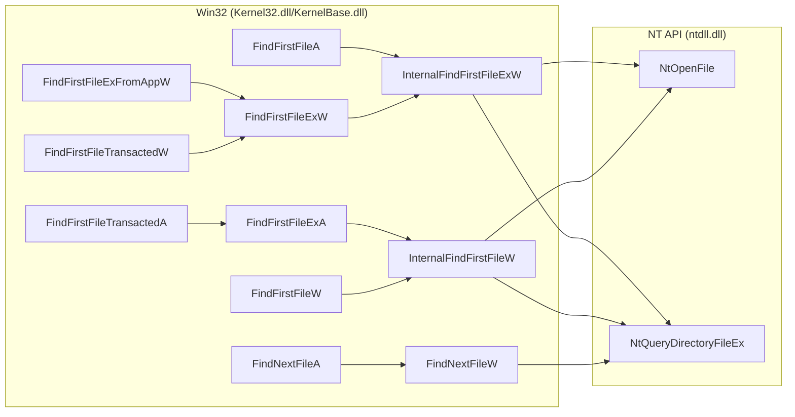

### File & Directory Creation

All `CreateFile*` and `CreateDirectory*` APIs funnel through internal functions to `NtCreateFile`, along with optional metadata operations.

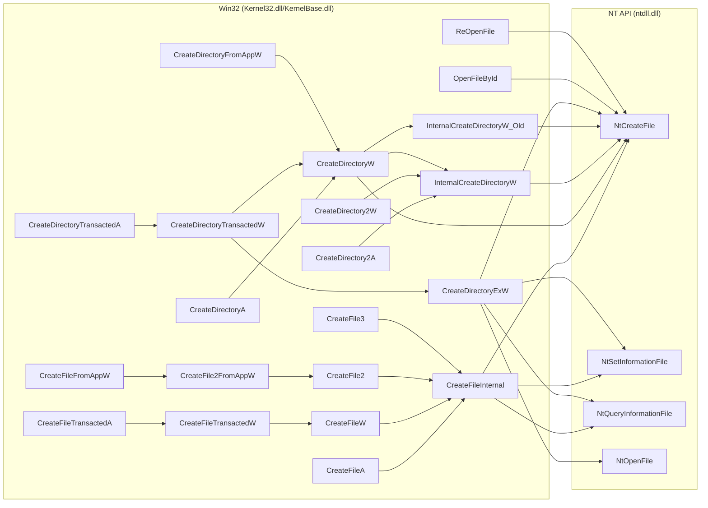

!!! info "ReOpenFile"

    Operates on existing handle (already redirected). No path redirection needed.

### File & Directory Deletion

All deletion APIs (`DeleteFile*` and `RemoveDirectory*`) converge through internal functions (`InternalDeleteFileW` and `InternalRemoveDirectoryW`) to NT-level operations.

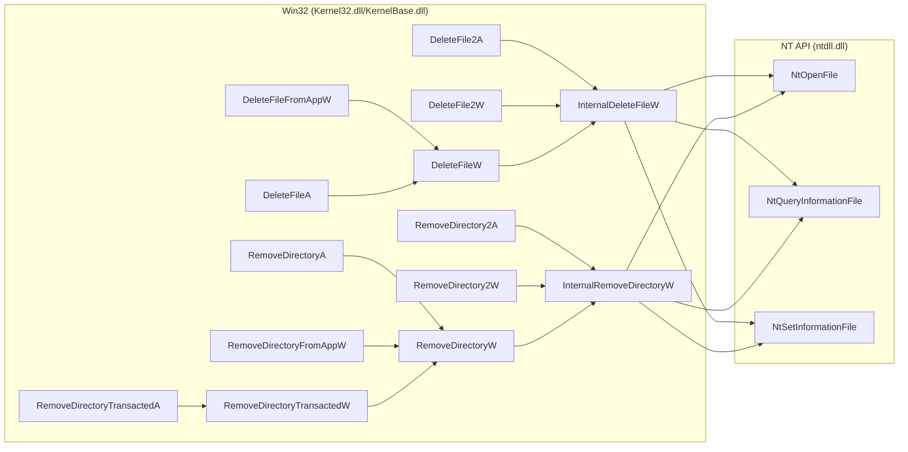

### Read/Write Operations

All file read and write operations, including file pointer positioning and file size modification, funnel through NT-level read/write APIs.

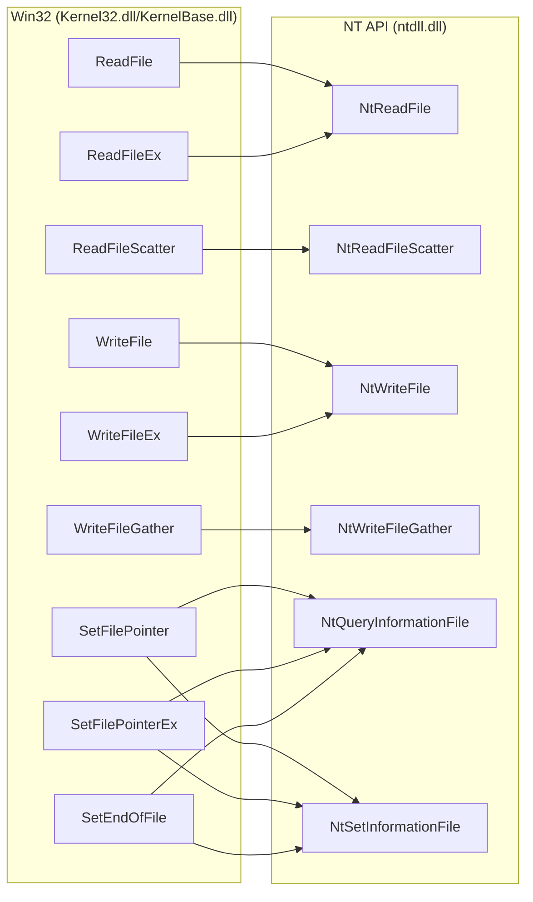

### File Attributes

Query and modification of file attributes. Path-based queries use `GetFileAttributes*` and `SetFileAttributes*` APIs, handle-based queries use `GetFileInformationByHandle*` APIs, and name-based queries use `GetFileInformationByName`.

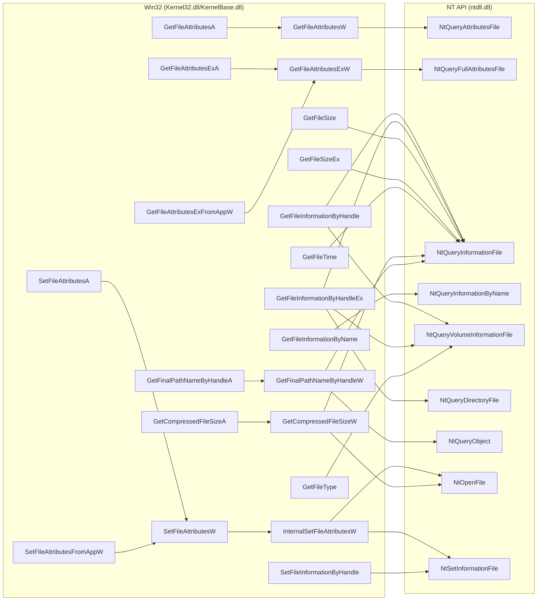

!!! info "NtQueryVolumeInformationFile does not need emulation"

    `NtQueryVolumeInformationFile` queries volume-level information (filesystem type, serial number, etc.) rather than individual file metadata. Since we're not virtualizing entire volumes, this API can pass through without interception.

!!! info "GetCompressedFileSize* APIs"

    `GetCompressedFileSizeA` and `GetCompressedFileSizeW` query the on-disk size of NTFS compressed files (which differs from logical file size for compressed files). For virtual files, return the regular file size. For redirected files, simply redirect the path and let the underlying file system report its compressed size.

!!! info "GetFileVersion* APIs"

    `GetFileVersionInfoA`, `GetFileVersionInfoW`, `GetFileVersionInfoExA`, `GetFileVersionInfoExW`, and related APIs extract embedded version resources from PE files. These are handled by the standard file read/open APIs (`NtCreateFile`, `NtReadFile`) and don't require separate hooking.

### File Copy & Move Operations

All `CopyFile*` variants converge through `BasepCopyFileExW`. `MoveFile*` variants converge through `MoveFileWithProgressTransactedW` or `MoveFileWithProgressW`, with some move operations delegating to copy for cross-volume moves.

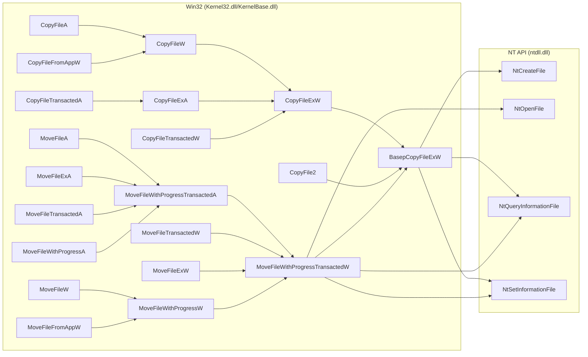

### Links & Symbolic Links

Creation and enumeration of hard links and symbolic links through dedicated APIs.

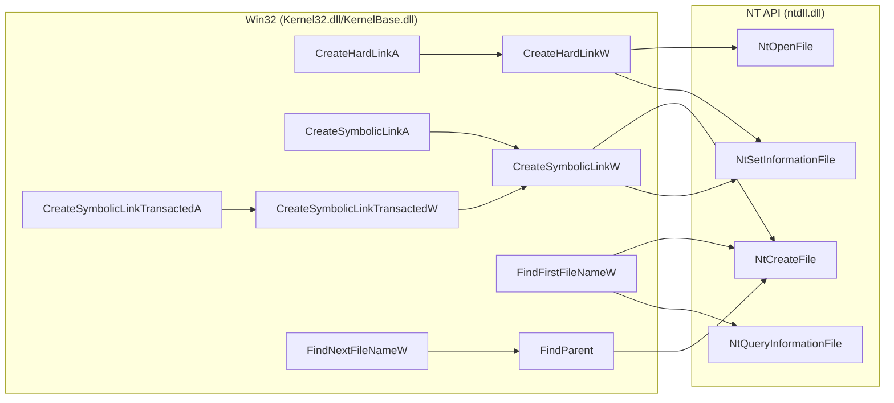

### Memory Mapped Files

All `CreateFileMapping*` APIs for memory-mapped file creation converge to NT section APIs.

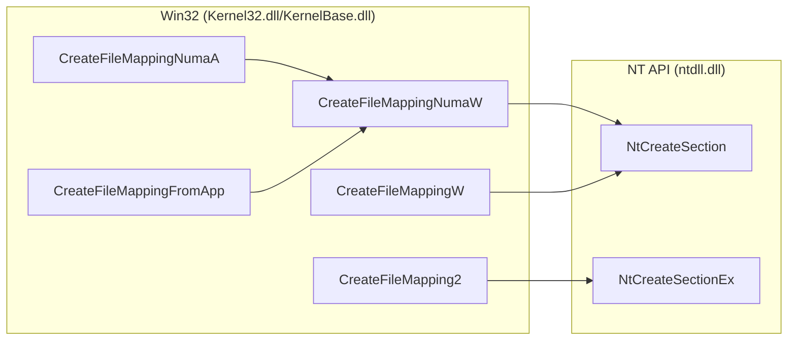

### Change Notifications

Directory change monitoring APIs for tracking file system modifications.

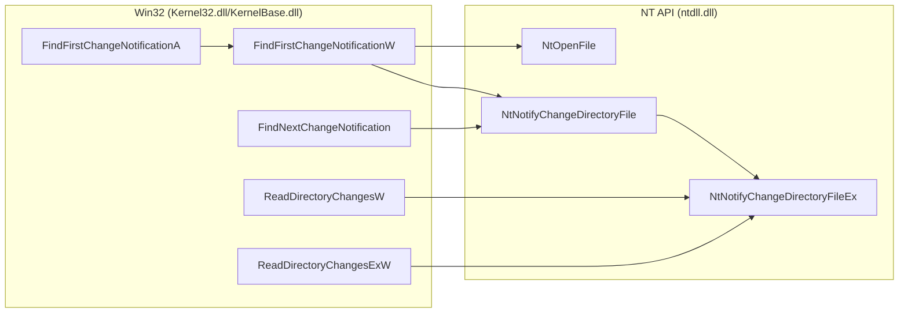

### Handle Lifetime Management

Handle cleanup operations that need hooking for internal state tracking.

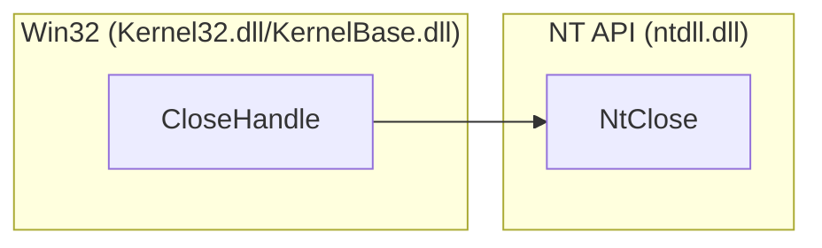

!!! info "Why hook NtClose?"

    We need to hook `NtClose` for lifetime management - tracking when file handles are closed to clean up internal VFS state.

### Notable Functions (Not Relevant for Games)

!!! info "We don't care about these APIs"

    The following APIs are documented for completeness but are **not relevant** for game modding:
    
    - They have not been used in games
    - They have no reason to be used in games  
    - Game stores don't support these features

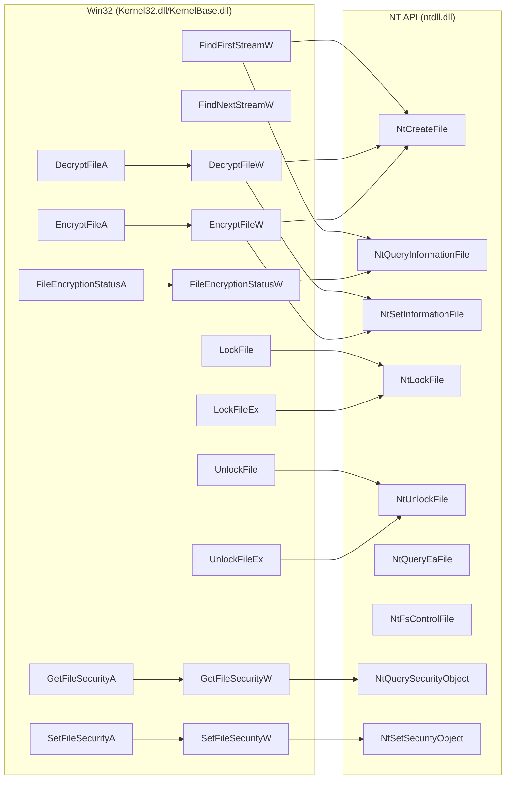

**What are these APIs:**

- **NTFS Alternate Data Streams** (`FindFirstStreamW`, `FindNextStreamW`) - Unsupported by game stores.
- **File Locking** (`LockFile`, `LockFileEx`, `UnlockFile`, `UnlockFileEx`) - Never seen a program that uses these APIs.
- **File Encryption** (`DecryptFile*`, `EncryptFile*`, `FileEncryptionStatus*`, `OpenEncryptedFileRaw*`) - Not supported with any game store, or even legacy games.
- **Security Descriptors** (`GetFileSecurity*`, `SetFileSecurity*`, `GetSecurityInfo`, `SetSecurityInfo`, `GetNamedSecurityInfo*`, `SetNamedSecurityInfo*`) - ACL management. Not supported with any game store, or even legacy games.
- **Extended Attributes** (`NtQueryEaFile`) - DOS attributes, NTFS security descriptors, etc. Games can't have these, Windows specific and stores don't support it.
- **File System Control** (`NtFsControlFile`) - Making sparse files, enabling NTFS compression, create junctions. This operates on file handles from `NtCreateFile`, so should still be redirected nonetheless.

!!! note "Roots (as of Windows 11 25H2)"

    Look at [Fileapi.h](https://learn.microsoft.com/en-us/windows/win32/api/fileapi/nf-fileapi-createdirectory2a) and [Winbase.h](https://learn.microsoft.com/en-us/windows/win32/api/winbase/nf-winbase-createdirectorytransacteda). These are good resources that are fairly up to date for Win32.
    For UWP, see [Fileapifromapp.h](https://learn.microsoft.com/en-us/windows/win32/api/fileapifromapp/nf-fileapifromapp-createfilefromappw).

    The above graphs were made using those as the starting point; combines with own searching through exports.

!!! info "About Transactional NTFS (Deprecated)"

    This is a feature introduced in Windows Vista (2007), and deprecated in Windows 8 in 2012. It was deprecated due to lack of adoption and complexity. Documentation heavily discourages its use and notes it as 'slated for removal'.

    The code for this function wasn't even moved from `kernel32.dll` to `kernelbase.dll`. Likewise, I've never to date seen a program that uses this feature.

    Behind the scenes this uses the regular APIs, but wrapped around `RtlGetCurrentTransaction` and `RtlSetCurrentTransaction` calls. So whatever we write will nonetheless work out the box. Included in the graphs for completeness.

    - ✅ `CopyFileTransactedA`
    - ✅ `CopyFileTransactedW`
    - ✅ `CreateDirectoryTransactedA`
    - ✅ `CreateDirectoryTransactedW`
    - ✅ `CreateFileTransactedA`
    - ✅ `CreateFileTransactedW`
    - ✅ `CreateSymbolicLinkTransactedA`
    - ✅ `CreateSymbolicLinkTransactedW`
    - ✅ `FindFirstFileTransactedA`
    - ✅ `FindFirstFileTransactedW`


!!! info "About WinRT/UWP Brokered 'FromApp' Functions (Windows 10 1803+)"

    Brokered calls are API calls that go through `RuntimeBroker.exe`, which acts as a security intermediary between UWP apps running in an AppContainer sandbox and system resources they need to access.
    
    The broker enforces capability-based security and permission checks.

    There are 2 types of APIs supported for WinRT/UWP:

    1. APIs such as `CreateFile2`. These are heavily restricted to only support `ApplicationData.LocalFolder` or `Package.InstalledLocation` directories. 
    2. APIs such as `CreateFile2FromAppW` will first run e.g. `CreateFile2`, and if that fails, it will route through the 'broker', i.e. `BrokeredCreateFile2` in `ext-ms-win-winrt-storage-win32broker-;1-1-0.dll`.
        - This would require an extra hook on a separate process.

    I have not experimented, but based on code inspection, it'll redirect, then likely fail due to `ApplicationData.LocalFolder`/`Package.InstalledLocation` limitation, and then try routing through the broker (separate process).

    !!! warning "This is inconsequential for most games."

        ***This section concerns ONLY TRUE UWP APPS***

        Most (pretty much all) games on the Xbox Store are Win32 titles which run using 'Desktop Bridge' a.k.a. 'Project Centennial'.

        These Apps declare `<rescap:Capability Name="runFullTrust" />` in `AppXManifest.xml`, meaning they have full access to the filesystem like regular Win32 apps.

        In those (basically all) cases, the VFS will run just fine, as it has been for a good handful of games with existing Reloaded-II mods.

        It may be possible you can just add `runFullTrust` to any pure UWP app to have it work; that I'm not sure. Never ran into a real UWP game.

!!! note "On Windows 10 1709+, `NtQueryDirectoryFileEx` API becomes available and `NtQueryDirectoryFile` acts as a wrapper around it."

    In the VFS we would hook both APIs, and detect if one recurses to the other using a semaphore. If we're recursing from `NtQueryDirectoryFile` to `NtQueryDirectoryFileEx`, we skip the hook code.
    
    **`NtNotifyChangeDirectoryFileEx`:** Conversely, `NtNotifyChangeDirectoryFile` wraps `NtNotifyChangeDirectoryFileEx` on modern Windows versions. I have not verified which version made this change.
    
    **Wine Compatibility:** These `Ex` variants are not implemented in Wine. The base APIs (`NtQueryDirectoryFile` and `NtNotifyChangeDirectoryFile`) work directly without wrapper behavior.

## Hook Endpoints (Linux)

!!! info "Native Linux games, not Wine. Wine is covered by Windows."

Normally on operating systems, you perform a 'syscall' to request services from the kernel. On Windows, this is abstracted away by `ntdll.dll` APIs; since the order of the syscalls can change between Windows versions.

On Linux, there is a stable order of syscalls, so programs can syscall directly. Usually, doing these syscalls is abstracted away by `libc` (e.g. `glibc`); so you never write them directly.

With that in mind, there are 3 options for hooking file I/O on native Linux:

1. Hook `libc` (i.e. `glibc`). Will work for ~99% of the programs out there. But some can syscall directly; e.g. Zig programs or those where libc is statically linked into the binary, i.e. `musl` instead of `glibc`.
2. Directly patch [syscalls](https://syscalls.mebeim.net/?table=x86/64/x64/latest) for every loaded in library. 100% coverage. We add a jump to our hook function if we know the syscall number. If we don't, we check it in the hook.
3. Use `ptrace` to intercept syscalls at the kernel boundary. This is the 'officially' supported solution, but has notable performance overhead; and not every distro will have `ptrace` allowed out the box. This is what `Snap` does on Ubuntu; and is probably part the reason people complain about startup times.

The ***objectively correct*** solution is Option 2 given our requirements. (Performance + Coverage). A tiny bit of assembly is required, i.e. We run a disassembler on every loaded library (`.so` file) to find syscall instructions and patch them to jump to our hook functions. 

This would need to be done for every arch we want to support (i.e. Aarch64, x86_64, etc.). After first arch is added (x86_64), additional arch(es) would take around a day to support; provided nothing unexpected happens (shouldn't).

This stuff requires some low level knowledge but is rather trivial for me (Sewer).

!!! tip "As for the rest, on Linux, the file I/O syscalls are way simpler than the APIs in Windows."

    As a result, the actual VFS implementation itself would be much simpler on Linux than on Windows.

## Layer 1: Virtual FileSystem

!!! info "Reminder: [Layer 1 deals with the 'where' problem](#layer-1-virtual-filesystem)"

- **`NtCreateFile`** & **`NtOpenFile`**
    - Intercept file creation/open operations. 
      - Check if path should be redirected when creating new files.
      - Substitute with target path before calling original API.
    - For 'virtual files', spoof creation to succeed without touching disk.

- **`NtQueryDirectoryFile`** & **`NtQueryDirectoryFileEx`**
    - Inject virtual files into directory search results. 
      - When application searches a directory, inject registered virtual files into the result set.
    - Uses semaphore to avoid recursion between the two APIs on Windows 10+.

- **`NtQueryAttributesFile`** && **`NtQueryFullAttributesFile`** - Return metadata for virtual/redirected files.

- **`NtClose`** - Track when file handles are closed. Used for internal handle lifecycle management.

If/when we implement write support, we would also hook APIs such as:

- **`NtDeleteFile`** - Handle deletion operations on virtual/redirected files. Intercept deletion requests and handle appropriately.

## Layer 2: File Emulation Framework

### What It Does

Synthesizes file data on-the-fly by intercepting read operations. Instead of returning data from disk, Layer 2 generates the file content dynamically by merging data from multiple sources.

Uses Layer 1 to make emulated files visible in directory searches and to handle path routing.

### Hooked APIs

- **`NtCreateFile` & `NtOpenFile`** - Detect when an emulated file is being opened. Match the file path against registered emulator routes. If matched, call into the emulator's `try_create_file` method to initialize emulator state and create internal data structures for synthesizing the file.

- **`NtReadFile`** - Intercept file read operations. If the file is being emulated, use the StreamSlice array to determine where data comes from. Read from source files/locations and return synthesized data instead of the original file data.

- **`NtSetInformationFile`** - Intercept handle update operations. Track file pointer position updates (seek operations). Emulated files need to maintain their own file pointer state so that read operations know where to read from.

- **`NtQueryInformationFile`** - Intercept file information queries. Report the emulated file's size and attributes. The emulated file size may differ from the original file on disk.

- **`NtQueryFullAttributesFile`** - Intercept file attribute queries. Report the emulated file's size and full attributes. Used when applications check file metadata without opening the file.

- **`NtClose`** - Intercept file close operations. Dispose of emulator internal state for the emulated file (such as current read offset). Free internal data structures for that emulated file instance.

**[→ Complete Hook Details](File-Emulation-Framework/Implementation-Details/Hooks.md)**

### Dependencies on Layer 1

- Calls `RegisterVirtualFile()` to make emulated files visible in directory listings
- Leverages Layer 1's redirect system for route-based file targeting
- Layer 1 handles the path redirection; Layer 2 handles the data synthesis

### Data Structures

**Emulated File Tracking:**

- Hash table keyed by **file handle** (`HANDLE` on Windows)
- Value contains emulator instance state for that specific file

**StreamSlice Array:**

Each emulated file contains an array of `StreamSlice` objects representing where data comes from:

```rust
struct StreamSlice {
    offset: u64,      // Where in emulated file this data appears
    length: u64,      // How much data this slice provides
    source: Source,   // Where to read data from
}

enum Source {
    File { handle: HANDLE, offset: u64 },  // Read from another file
    Memory { ptr: *const u8 },              // Read from memory
    Zeros,                                   // Return zeros (padding)
}
```

For each read operation:

1. Binary search the StreamSlice array to find which slice(s) cover the requested range
2. For each slice, read from the appropriate source
3. Combine the data and return to application

**Performance Characteristics:**

- Hash table lookup: ~8ns (constant time)
- Binary search on StreamSlice array: 2.5-5.5ns for <64 slices, 35ns for 16384 slices (logarithmic)
- Total overhead per read: ~15ns for typical files

### Implementation Notes

- **Zero-copy when possible:** If reading entire file from single source, can pass through directly
- **Lazy initialization:** Emulator state created only when file is actually opened
- **Route matching:** Uses suffix matching on normalized paths
- **Priority system:** More specific routes take precedence over generic ones
- **Thread safety:** Each file handle has independent state; thread-safe for concurrent operations on different handles

**[→ Full Implementation Details](File-Emulation-Framework/About.md)**

---

## How does this compare with my previous work?

!!! info "Production-Tested Foundation"

    The architecture described here builds upon the one in Reloaded-II; which have been used in production for a few years.

This documentation iterates and improves upon two major implementations:

### FileEmulationFramework (Reloaded-II)

**[FileEmulationFramework](https://github.com/Sewer56/FileEmulationFramework)** is the reference implementation for the Layer 2 architecture (with built in Layer 3 plugin). Actively used in production since 2022, across several archive formats and games. An iteration of another project of mine from 2020.

### reloaded.universal.redirector

**reloaded.universal.redirector** implements the Layer 1 architecture with comprehensive read operation support in the unreleased `rewrite-usvfs-read-features` branch (1). Original simpler file open hook actively used in production since 2019.
{ .annotate }

1.  Fully working and complete, including on Wine, but unreleased due to certainty it would break with future .NET Runtime upgrades from problems involving GC transitions.<br/><br/>A certain case in Wine already reproduced the inevitable.

### Key Architectural Difference

**Separation of Archive Emulation and Virtual Files**

Reloaded-II's `FileEmulationFramework` was originally designed for **archive replacement** - creating emulated archives lazily when accessed to avoid generating massive files up front.

!!! example "Original Use Case"
    Replace a 60GB game archive with an emulated version, without using disk space.

Over time, new requirements emerged: **NxVFS** integration and **synthesizing arbitrary files** (e.g., adding files to a game's load list). This created architectural inconsistency - some files lazy, others up front - and unnecessary coupling between archive emulation and virtual file management.

**The new solution**: Split these as separate concerns. The VFS generates all emulated files **up front** during registration, while archive emulation is handled distinctly when needed. This provides predictable state, reduced overhead at file open time, and cleaner architecture. The marginal memory savings from lazy initialization weren't worth the complexity.

### Other Differences

- Added support for Memory Maps.
- Added missing NtOpenFile API. (& other related miscellany)
- APIs use handles to unregister/dispose.